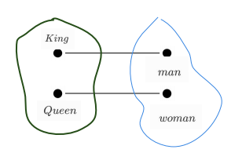
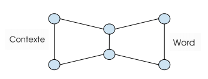
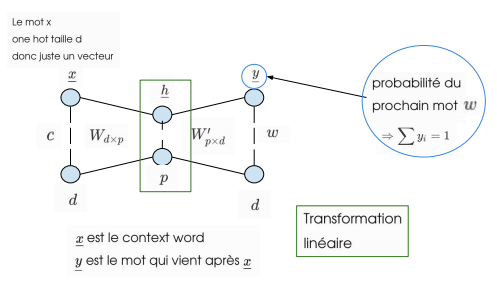
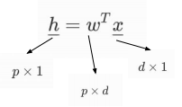
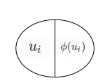
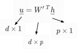

## Word2Vec

### Introduction

On va définir un language model, une distribution pour une suite de mots. Cette suite sera comprise par la probabilité jointe, et la probabilité que ces mots apparaissent ensembles:
$$
P(w_1, ..., w_T)
$$
Cette probabilité jointe va être utile entre autre pour la traduction, où l'ordre des mots à une importance, dans l'exemple suivant, la probabilité de gauche sera supérieure, car son sens eest correct:
$$
P(the~cat~is~small) \gt P(small~the~is~cat)
$$
Pour la représentation, on utiise généralement le "one-hot encoding":
$$
[0~~0~0~...~1~0~0]
$$

> <u>**Problèmes**</u>:
>
> * Dans les cas où la taille du vocabulaire est très grandes 
> * Ne dit rien sur la sémantique (le sens de la phrase)

##### Idée 1:

---

On peut réduire la dimension par le classique SVG (Singular Value Decomposition)
$$
X = U \Sigma V^T
$$
Par exemple, avec LLE (slide) le problème est que la complexité est de $o(nd^2)$

##### Idée 2:

---

On va en fait, avoir deux sous-idées:

* **Word2Vec:** Prédire les mots environnants de chaque mot.
* **Glove:** On capture la fréquence de co-occurence directement

—> Ils sont tout les deux rapides et peuvent incorporer une nouvelle phrase/document ou l'ajout d'un mot dans le vocabulaire.

Ils sont tout les deux basés sur la **<u>matrice de co-occurence</u>**, on dira que:

* **Wor2Vec** utilise la matrice de co-occurence <u>implicitement</u>
* **Gloves** utilise la matrice de co-occurence <u>explicitement</u>

##### L'exemple des Reines et Rois

---

Un des exemples les plus marquants étaient celui du calcul vectorielle qui avait donné:
$$
vec(king)-vec(man)+vec(woman) \approx vec(queen)
$$
Comment ça marche ? En fait l'algorithme a créée deux clusters, un qui est celui titres de royauté et un second du type sexuel. Pour comparer des éléments d'un même cluster avec un autre, il suffit de calculer leurs distances. Celles qui sont similaires auront des propriétés identiques.

Ce qu'on peut écrire:
$$
vec(king) - vec(man)\approx vec(queen) - vec(woman) \\
vec(king) - vec(man) + vec(woman)\approx vec(queen)
$$

### Word2vec

Il y'a deux papiers sur word2vec:

* [Continuous bag-of-words (CBOW)]()

* [Skip-gram (celui qu'on se refère le plus souvent)]()

#### CBOW

----

On suppose une phrase, constitué d'un mot et d'un contexte, l'objectif est de **prédire le mot sachant le contexte**.
$$
\overbrace{\_~ \_ ~\_}^{Contexte}~ \underbrace{\_}_{mot} ~  \overbrace{ \_~ \_ ~ \_}^{Contexte}
$$
On le modélise en réseau de la façon suivante:

#### Skip-Gram

---

On est dans la situation inverse, **à partir d'un mot, on veut prédire le contexte**

Pour l'instant nous allons simplifier notre problème, avec un seul contexte et un seul mot
$$
\overbrace{\_}^{c}~ \underbrace{\_}_{mot} 

$$

On peut représenter mathématiquement, l'équation de la couche caché par:

Du fait de la sparsité du vecteur $\underline{x}​$ on va pouvoir se rendre compte qu'en fait son produit avec la matrice des poids est corresponds juste à une colonne de $w​$, ce qui va nous permettre d'avoir une astuce lors du calcul:
$$
\begin{bmatrix} 
- & - & X & ... \\
- & - & X & ...  \\
 \\
 \\
\end{bmatrix}
\begin{bmatrix} 
0  \\
0 \\
1 \\
. \\
. \\
0
\end{bmatrix}
$$

$h$ sera la $k$-ième colonnes de $w^T$ si $\underline{x}$ est non zéro à la ligne $k$ soit, et appelons ce nouveau vecteur $v_c$ qui corresponds au context
$$
\underline{v}_c = w_{k_{\bullet}^T} = \underline{h} = W^T \underline{x}
$$
Chaque unité de $\underline{y}​$ a deux parties:

Le $\phi$ sera une non linéarité sur $u_i$ une fonction d'activation.

Nous allons utiliser la même astuce matricielle, on définit $\underline{v}_w$ le vecteur correspondants aux mots

#### 

