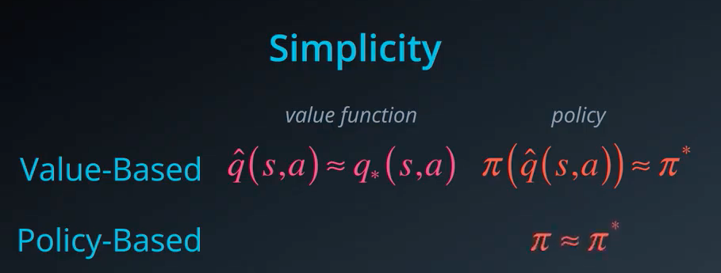
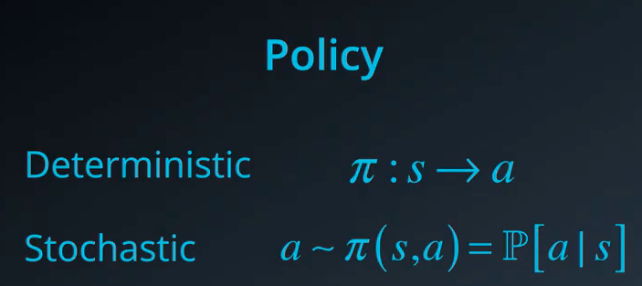
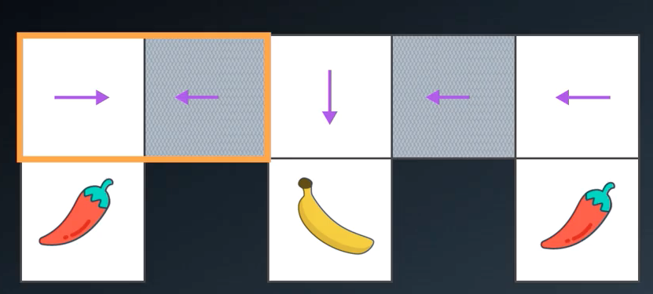
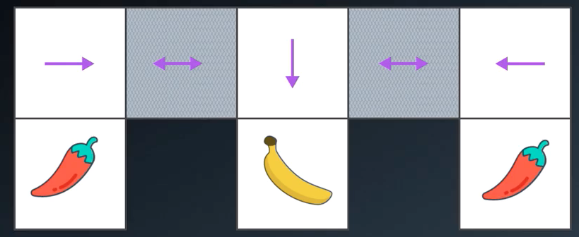
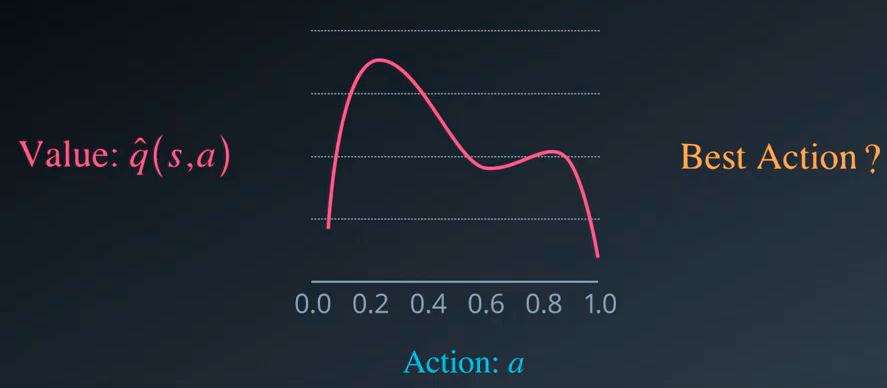

# Lesson 10: Policy-Based Methods

## 1. Why Policy-Based Methods ?

We might be wondering why do we need to find optimal policies directly when value baed methods seem to work so well. There are three arguments we'll consider:

1. Simplicity
2. Stochastic Policies
3. Contiunuous Action Space

Remember that in value based methods like Q-learning we invented this idea of a value function as an intermediate step towards finding the optimal policy. It helps us rephrase the problem in terms of something that is easier to understand and learn.

But if our ultimate goal is to find that optimal policy do we really need this value function ? Can we directly estimate the optimal policy ?

What such a policy would look like ? we recall and modify slightly the stochastic policy by consider it as a distribution that we sample

One of the advantage of policy based methods over value based methods is that they can learn true stochastic policies. This is like picking a random number from a special kind of machine one where the chances of each number being selected depends on some state variables that can be changed 

In contrast with epsilon greedy policy that add some randomness but it's a hack the underlying value function can leads us toward certain actions more than other

**example:**

* With rock paper cissors, the best strategy is to use a uniforme policy rather than a non-uniform and stochastic/deterministic policy can turn out to be non-uniform
* Another situation where stochastic policy helps is when we have aliased states that is two or more states that we perceive to be identical but are actually different 

If we take a blind monkey in this game, it will know when he is in the left and right cell it can touch the walls and feel that is has to move in the opposite direction. If it is in the middle it knows that it can only go down to get the bananas. The main problem is in the grey cells it doesn't know if it should go to the left or right. In thise case it will be stuck on the left, with a small greedy policy it could work but it would take too much time

The best it can do is to assign equal probability to move left or right from this Alias states

Continuous action spaces: trying to find the best action is by solving an optimization problem

## 2. Policy Function Approximation

