# Lesson 2: The RL Framework: The Problem

## 1. Introduction

This lesson covers material in **Chapter 3** (especially 3.1-3.3) of the textbook.

## 2. The Setting, Revisited

The RL framework is characterized by an agent learned to interact with its environment. We will assume that time evolves at discrete time steps.
At the initial time step, the agent observes the environment. Then, it must select an appropriate action in response. Then, at the next timestep in response to the agent action, the environment presents a new situation to the agent. At the same time the environment gives the agent a reward which provides some indication of wether the agent has responded appropriately to the environment. Then, the process continues ...

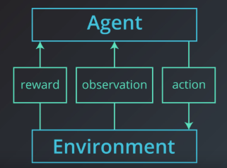

In general, we don't need to assume that the environment shows the agent everything he needs to make well-informed decisions. But it greatly simplifies the underlying mathematics if we do. So in this course, we'll make the assumption that the agent is able to fully observe what ever state the environment is in. And instead of referring to the agent as receiving an observation, **Huntsworth say that it receives the environment state**.

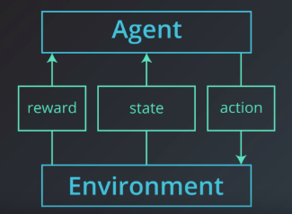

The Agent first receives the environment state which we denote by S0. Then, based on that observation the agent choose an action, A0, at the next tilmestep. The environment transition to a new state S1, and gives some reward, R1, to the agent and so on.

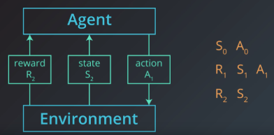

Every Agent has the goal to: **Maximize expected cumulative reward**.

## 3. Episodic vs. COntinuing tasks

**Episodic Task:** Interaction ends at some time step $T$, we refer the sequence $S_0,A_0,R_1,…,R_T,S_T$ as an "Episode". At time $T$ we look at the total reward, and use it again for the next game.

> Example: A car crash, a tetris game is finished.

**Continuing Task:** Interaction continues without limit $S_0,A_0,R_1,S_1,A_1,…$

> Example: Stock market


#### Episodic Task with Sparse Reward - Playing Chess:

-------

Say you are an agent, and your goal is to play chess. At every time step, you choose any action from the set of possible moves in the game. Your opponent is part of the environment; she responds with her own move, and the **state** you receive at the next time step is the configuration of the board, when it’s your turn to choose a move again. The **reward** is only delivered at the end of the game, and, let’s say, is +1 if you win, and -1 if you lose.

This is an **episodic task**, where an episode finishes when the game ends. The idea is that by playing the game many times, or by interacting with the environment in many episodes, you can learn to play chess better and better.

It's important to note that this problem is exceptionally difficult, because the feedback is only delivered at the very end of the game. So, if you lose a game (and get a reward of -1 at the end of the episode), it’s unclear when exactly you went wrong: maybe you were so bad at playing that every move was horrible, or maybe instead … you played beautifully for the majority of the game, and then made only a small mistake at the end.

When the reward signal is largely uninformative in this way, we say that the task suffers the problem of **sparse rewards**. There’s an entire area of research dedicated to this problem, and you’re encouraged to read more about it, if it interests you.

## 4. The reward hypothesis: Goals and rewards

**The Reward Hypothesis is defined as:** All goals can be framed as the maximization of expected cumulative reward. 

> For a self driving car: the goal is to learn to drive
>
> For a game: it is to play to win
>
> For a robot: Learn to walk

#### Making a Robot walk:

-----

**The actions for a robot** are the forces that the robot applies to its joints in order to move

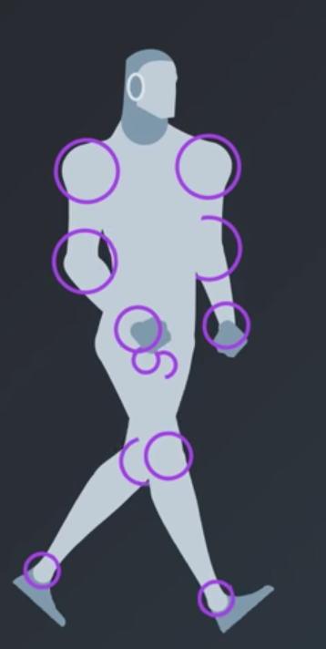

**The states** contains the positions and velocities of the joints at any point in time along with some measurements of the ground, this measurements contains how flat or how inclined the ground was, is there was a large step along the path and so on. The Researchers at ```Google DeepMind``` also added contact sensor data, so that it could determine if the robot was still walking or if it had fallen over.

So for the moment we have defined the following information:

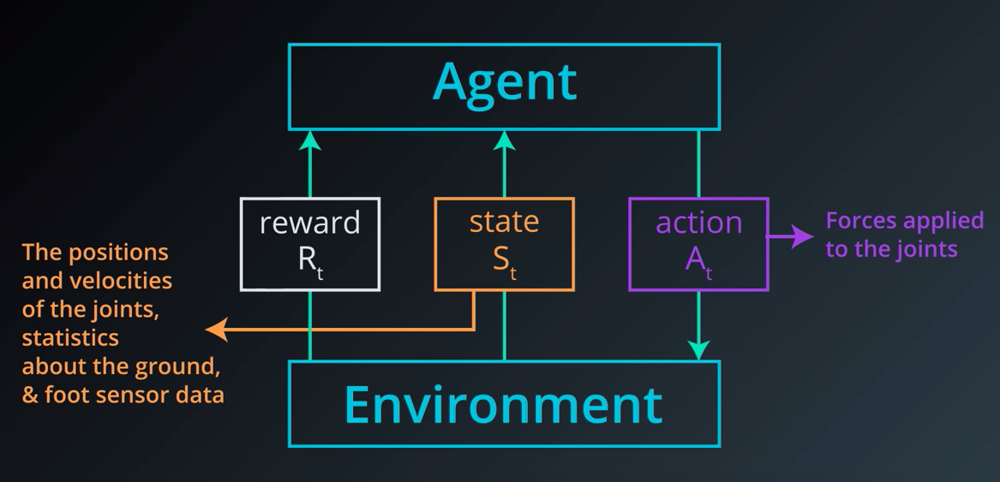

**Reward:** The reward structure from the DeepMind paper is surprisingly intuitive. The next line is pulled from the appendix of the DeepMind paper, Each term communicates to the agent some part of what we'd like it to accomplish.

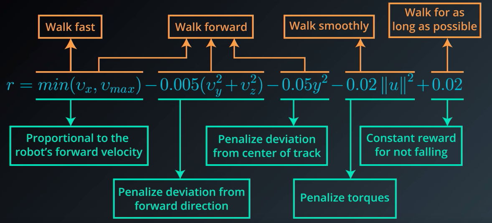

* The agent receives a reward proportional to its forward velocity. To begin, at every time step, the agent receives a reward proportional to its forward velocity. So if it moves faster, it gets more reward, but up to a limit. Here denoted $V_{max}$, 
* Since the researchers also wanted the humanoid to focus on moving forward, the agent is also penalized for moving left, right, or vertically
* It was also penalised if the humanoid moved its body away from the center of the track.
* But it's penalized by an amount proportional to the force applied to each joint. So, if the agent applies more force force to the joints, then more reward is taken away as punishment. 
* At every time step, the agent also receives some positive reward if the humanoid has not yet fallen. 

They frame the problem **as an episodic task** where if the human falls, then the episodic is terminated.

## 5. cumulative reward

Along these lines in the walking robot example, the agent always has reward at all time steps in mind, it will learn to choose movement designed for long term stability. So in this way, the robot moves a bit slowly to sacrifice a little bit of reward but it will payoff because it will avoid falling for longer and collect higher cumulative reward.

How exactly does it keep all time steps in mind ? All previous time steeps have already been decided as they're in the past. Only future reward are inside the agent's control.

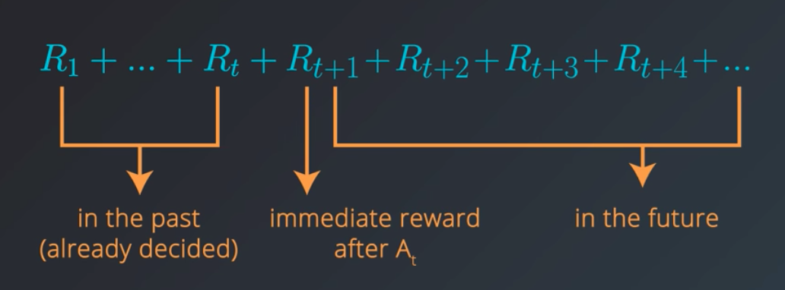

The agent will always choose an action towards the goal of maximizing the return but it's actually more accurate to say that the agent seeks to maximise expected return this it because **it's generally the case that the agent can't predict with complete certainty what the future reward is likely to be so it has to rely on a prediction or an estimate.**

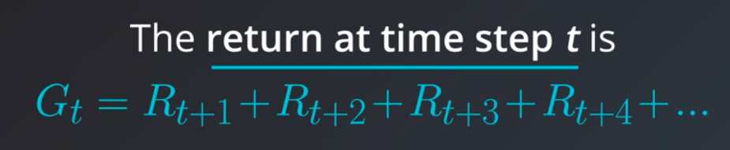

## 6. Discounted return

Consider a puppy, he cannot predict how much reward he could get at any point in the future, it makes more sense to consider that it's not entirely clear what the future holds especially if the puppy is still learning proposing and testing hypotheses and changing his strategy. It's more likely to have a much better idea of what's likely to happen in the near future. It should makes more sense to value rewards that come sooner more highly, that's the Discounted Return.

At time step $t$, the agent picks $A_t$ to maximize (expected) $G_t$. We define the Discounted Return $G_t$ as:
$$
G_t = R_{t+1} + \gamma R_{t+2} + \gamma^2 R_{t+3} + ...
$$
with the **discount rate** $\gamma \in [0,1]​$.

For $\gamma = 1$, the discounted return is $G_t = R_{t+1} +  R_{t+2} +  R_{t+3} + …$ basically the basic return 

For $\gamma = 0​$, the discounted return is $G_t = R_{t+1}​$ which is a very short-term return

### Pole-Balancing:

----

XXX

## 7. Markov decision process (mdp) - Part 1

We will learn how to rigorously define a reinforcement learning problem as a **Markov Decision Process (MDP)**

We will work with a recycling robot from the Sutton textbook. Consider a robot that's designed for picking up empty soda cans. The robot is equipped with arms to grab the cans and runs on a rechargeable battery. There's a docking station set up in one corner of the room and the robot has to sit at the station if it needs to recharge its battery.

Say, you're trying to program this robot to collect empty soda cans without human intervention. In particular, you want the robot to be able to decide for itself when it needs to recharge its battery. And whenever it doesn't need to recharge, you want it to focus on collecting as many soda cans as possible.

We'll say the **robot can perform three actions**:

* It can search the rooms for cans
* It can head to the docking station to recharge its battery
* Or it can stay put in the hopes that someone brings it a can

We refer to **the set of all possible actions as the action space**
$$
\mathcal{A} = [search, recharge, wait]
$$
The states could be:

* The charge left on the robot's battery. We will assume that the battery has one of two states (high and low amount of charge left)

We refer to **the set of all possible actons as the state space**
$$
\mathcal{S} = [high, low]
$$

### Notes

----

The state space $\mathcal{S}​$ is the set of **all nonterminal states**.

In continuing tasks (like the recycling task detailed in the video), this is equivalent to the set of **all states**

In episodic tasks, we use $\mathcal{S}^+$ to refer to **all states, including terminal states.**

In the event that there are some states where only a subset of the actions are available, we can also use $\mathcal{A}(s)$ to refer to the set of actions available in state $s \in  \mathcal{S}$  

----

## 8. Markov decision process (mdp) - Part 2

When the battery is at state high, we will consider only two states: ```wait```and ```search```, for search we will get a reward of four in any situation. When he waits he doesn't use any battery, we will set the reward at one.

We will give a reward of -3 in case of the robot try to search but ended up with no battery which involved a human to recharge it.

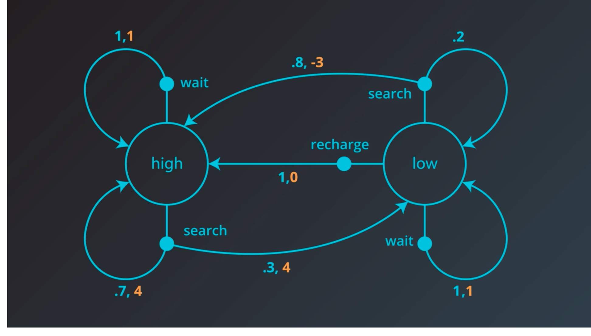

This picture completely characterize one method. What's important to emphasize here is how little information the environment uses to make decisions. It doesn't care what situation was presented to the agent 10 or 100 or even two prior. And it doesn't look at the actions that the agent took prior to the last one. And how well the agent is doing or how much reward it's collected has no effect on how the environment chooses to respond to the agent.

### Quizz: One-Step Dynamics

---

Consider the recyling robot example. In the previous concept, we described one method that the environment could use to decide the state and reward, at any time step.

Say at an arbitrary time step $t​$, the state of the robot's battery is high ($S_t=high​$). Then, in response, the agent decides to search ($A_t=search​$). You learned in the previous concept that in this case, the environment responds to the agent by flipping a theoretical coin with 70% probability of landing heads. Then we can be at state:, $(S_{t+1}=high,~ R_{t+1}=4)​$ or $(S_{t+1}=low,~ R_{t+1}=4)​$

When the environment responds to the agent at time step $t+1​$, it considers only the state and action at the previous time step $(S_t, A_t)​$. In particular, it does not care what state/actions was presented to the agent one step prior. Mathematically $(S_0,…,S_{t-1})​$ and $(A_0,…,A_{t-1})​$.

Furthermore, how well the agent is doing or how much reward it is collecting, has no effect on how the environment chooses to respond to the agent. $(R_0,…,R_{t})​$

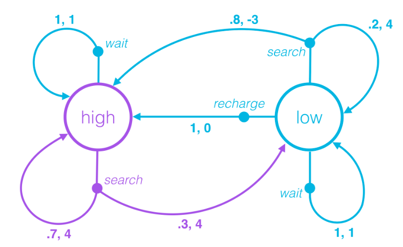

Because of this, we can completely define how the environment decides the state and reward by specifying:
$$
p(s′,r∣s,a)≐P(S_{t+1}=s',R_{t+1}=r∣S_t=s,A_t=a)
$$
for each possible $s',r,s$ and $a$. These conditional probabilities are said to specify the **one-step dynamics** of the environment.

Then, when the environment responds to the agent at the next time step,

- with 70% probability, the next state is high and the reward is 4. In other words, $p(\text{high}, 4|\text{high},\text{search}) = \mathbb{P}(S_{t+1}=\text{high}, R_{t+1}=4|S_{t} = \text{high}, A_{t}=\text{search}) = 0.7​$
- with 30% probability, the next state is low and the reward is 4. In other words, $p(\text{low}, 4|\text{high},\text{search}) = \mathbb{P}(S_{t+1}=\text{low}, R_{t+1}=4|S_{t} = \text{high}, A_{t}=\text{search}) = 0.3$.

## 9. Markov decision process (mdp) - Part 3

**Formally we define: A (finite) Markov Decision Process (MDP) as a:**

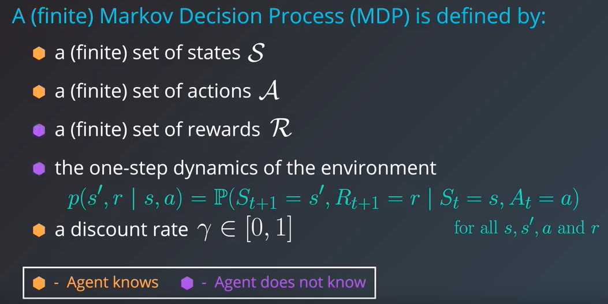

For the discount rate we usually should set the value to be close to one, like $\gamma=0.9$

This framework works for continuing and episodic tasks and whenever you have a problem that you want to solve with reinforcement learning wether it entails self-driving car or stock trading agent, this is the framework


