# Lesson 3: The RL Framework: The Solution

## 1. Introduction

This lesson covers material in **Chapter 3** (especially 3.5-3.6) of the textbook. This lesson will be more technical that in the last lesson.

## 2. Policies

We've seen that we use a Markov decision process or MDP as a formal definition of the problem that we'd like to solve with reinforcement learning. In this lesson,  we specify a formal definition for the solution to this problem. We can start to think of the solution as a series of actions that need to be learned by the agent toward the pursuit of a goal. As long as the agent learns an appropriate action response to any environment state that it can observe, we have a solution to our problem. This motivates the idea of a **policy**:

**A deterministic policy** is a mapping:
$$
\pi : \mathcal{S} \rightarrow \mathcal{A}
$$
**A stochastic policy** is a mapping:
$$
\pi : \mathcal{S} \times \mathcal{A} \rightarrow [0,1] \\ 
\pi(a \mid s) = \mathbb{P}(A_t=a \mid S_t=s)
$$
**Example:**

We give a set of example of deterministic and stochastic policy:

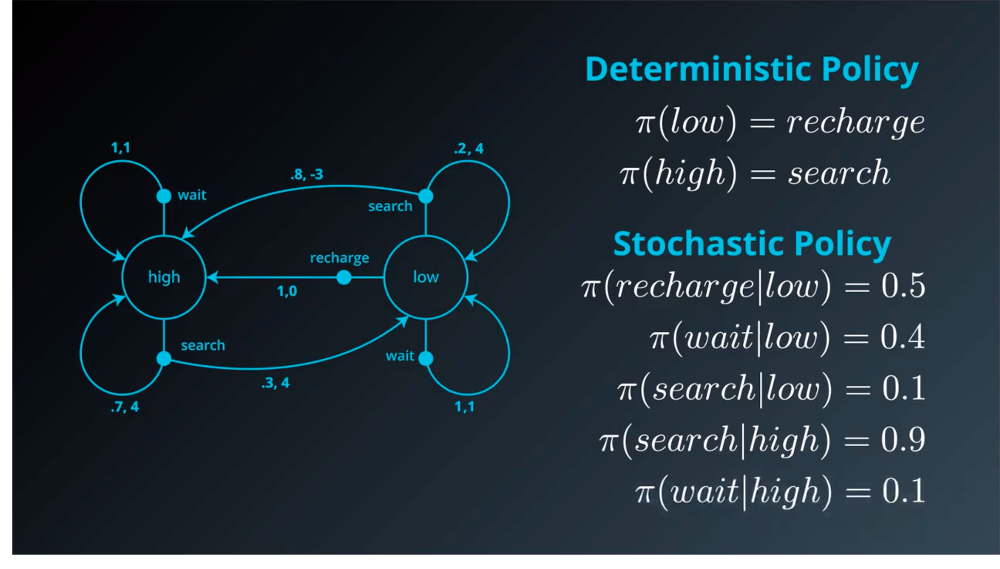

We can also write the Deterministic Policy as a Stochastic Policy as written below: (we will have probability of zero or one)

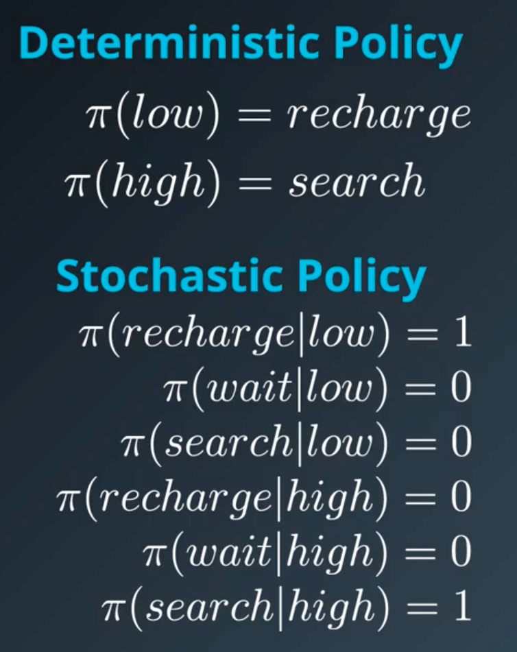

## 3. Gridworld example

To understand how to go about searching for the best policy, it will help to have a running example. So consider a world which is primarily composed of nice patches of grass, but two out of the nine locations in the world have large mountains. The agent can only move up, down, left or right; its goal is to get to the bottom right hand corner of the world as quickly as possible. We'll think of this as an **episodic task** where an episode **finishes when the agent reaches the goal**.

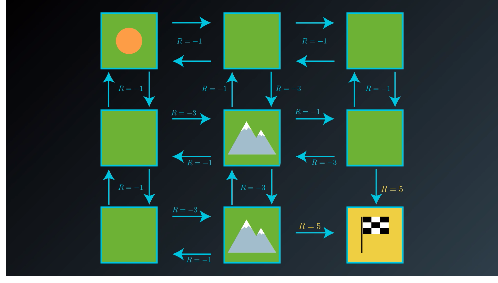

When the agent reaches the goal it gets a reward of five, and the episodee ends. Otherwise for a mountain the reward will be $R=-3$ or it is $R=-1$ for a the other ones.

## 4. state-value functions

We're looking with this grid world example and looking for the best policy that leads us to the goal state as quickly as possible. So let's start with a very bad policy so we can work to improve it, specifically we'll look at a **policy where the agent visists every state** in this very **roundabout manner.**

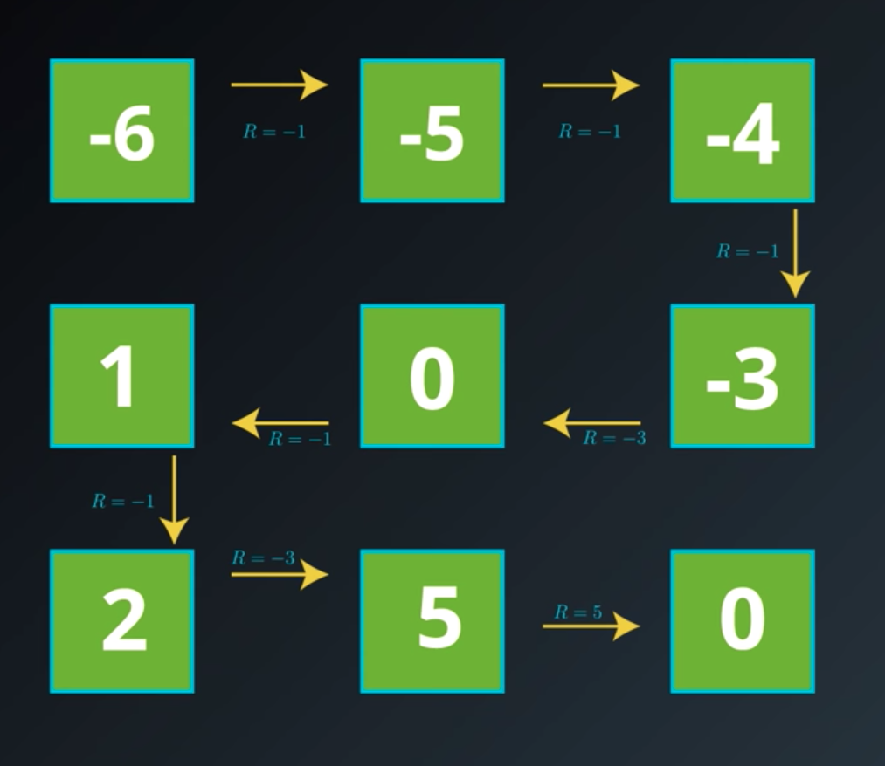

Let's calculate the cumulative reward, we will set the discount rate to one, $\gamma=1$ then the return for the initial patch will be $-6$, then we change the starting point to the second patch we get $-5​$ and so on.

We will attach some notation and terminology to this process we just followed you can think of this grid of numbers as a function of the environment State for state it has a corresponding number and we refer to this function as the ```state value function```. 

For each state, the **state-value function** yields the expected return, if the agent started in that state, and then followed the policy for all time steps. More mathematically you write:


## 5. bellman equations

If you take your time yourself to calculate the value function for this policy you might notice that you don't need to start your calculations from scratch every time. Let's erase most of these values with the exception of the ones at the bottom. 

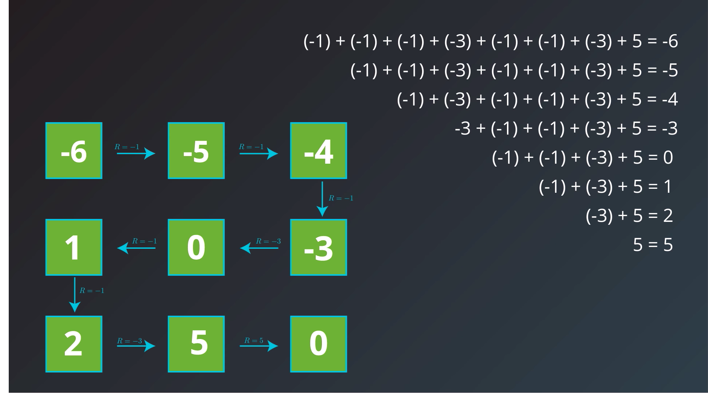

Let's see how we calculate it backward, for the patch of ```one``` we can get the value of the next one ```2```and add up the value of the reward ```R=-1```then we get back the value of our patch. We can express **the value of any states** by the **immediate reward** plus **the value of the state that follows**

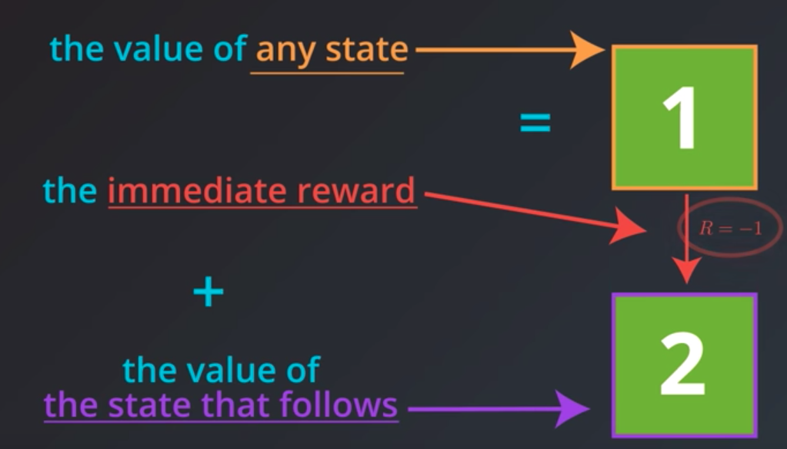

But in general we want to have a framework that takes discounting into account so we'll need to use the discounted value of the state that follows we can express this idea in terms of the **Bellmen expectation equation**. We will use it extensively for now the main idea is that we can express the value of any state in the MDP in terms of the immediate reward and the discounted value of the state that follows

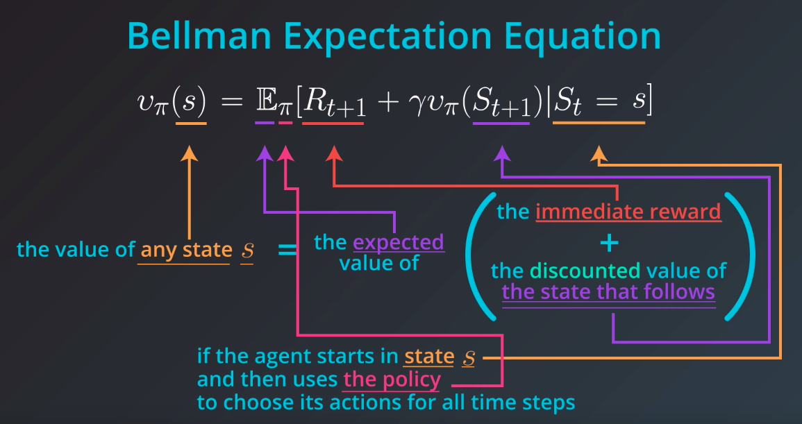

In this gridworld example, once the agent selects an action:

# Bellman Equations


In this gridworld example, once the agent selects an action,

- it always moves in the chosen direction (contrasting general MDPs where the agent doesn't always have complete control over what the next state will be), and
- the reward can be predicted with complete certainty (contrasting general MDPs where the reward is a random draw from a probability distribution).

In this simple example, we saw that the value of any state can be calculated as the sum of the immediate reward and the (discounted) value of the next state.

Alexis mentioned that for a general MDP, we have to instead work in terms of an *expectation*, since it's not often the case that the immediate reward and next state can be predicted with certainty. Indeed, we saw in an earlier lesson that the reward and next state are chosen according to the one-step dynamics of the MDP. In this case, where the reward r*r* and next state s'*s*′ are drawn from a (conditional) probability distribution p(s',r|s,a)*p*(*s*′,*r*∣*s*,*a*), the **Bellman Expectation Equation (for v_\pivπ)** expresses the value of any state s*s* in terms of the *expected* immediate reward and the *expected* value of the next state:

v_\pi(s) = \text{} \mathbb{E}_\pi[R_{t+1} + \gamma v_\pi(S_{t+1})|S_t =s].*v**π*(*s*)=E*π*[*R**t*+1+*γ**v**π*(*S**t*+1)∣*S**t*=*s*].


<div class="index-module--markdown--2MdcR ureact-markdown "><p>In this gridworld example, once the agent selects an action, </p>
<ul>
<li>it always moves in the chosen direction (contrasting general MDPs where the agent doesn't always have complete control over what the next state will be), and </li>
<li>the reward can be predicted with complete certainty (contrasting general MDPs where the reward is a random draw from a probability distribution).</li>
</ul>
<p>In this simple example, we saw that the value of any state can be calculated as the sum of the immediate reward and the (discounted) value of the next state.  </p>
<p>Alexis mentioned that for a general MDP, we have to instead work in terms of an <em>expectation</em>, since it's not often the case that the immediate reward and next state can be predicted with certainty.  Indeed, we saw in an earlier lesson that the reward and next state are chosen according to the one-step dynamics of the MDP.  In this case, where the reward <span class="katex"><span class="katex-mathml"><math><semantics><mrow><mi>r</mi></mrow><annotation encoding="application/x-tex">r</annotation></semantics></math></span><span class="katex-html" aria-hidden="true"><span class="strut" style="height:0.43056em;"></span><span class="strut bottom" style="height:0.43056em;vertical-align:0em;"></span><span class="base"><span class="mord mathit" style="margin-right:0.02778em;">r</span></span></span></span> and next state <span class="katex"><span class="katex-mathml"><math><semantics><mrow><msup><mi>s</mi><mo mathvariant="normal">′</mo></msup></mrow><annotation encoding="application/x-tex">s'</annotation></semantics></math></span><span class="katex-html" aria-hidden="true"><span class="strut" style="height:0.751892em;"></span><span class="strut bottom" style="height:0.751892em;vertical-align:0em;"></span><span class="base"><span class="mord"><span class="mord mathit">s</span><span class="msupsub"><span class="vlist-t"><span class="vlist-r"><span class="vlist" style="height:0.751892em;"><span style="top:-3.063em;margin-right:0.05em;"><span class="pstrut" style="height:2.7em;"></span><span class="sizing reset-size6 size3 mtight"><span class="mord mtight"><span class="mord mathrm mtight">′</span></span></span></span></span></span></span></span></span></span></span></span> are drawn from a (conditional) probability distribution <span class="katex"><span class="katex-mathml"><math><semantics><mrow><mi>p</mi><mo>(</mo><msup><mi>s</mi><mo mathvariant="normal">′</mo></msup><mo separator="true">,</mo><mi>r</mi><mi mathvariant="normal">∣</mi><mi>s</mi><mo separator="true">,</mo><mi>a</mi><mo>)</mo></mrow><annotation encoding="application/x-tex">p(s',r|s,a)</annotation></semantics></math></span><span class="katex-html" aria-hidden="true"><span class="strut" style="height:0.751892em;"></span><span class="strut bottom" style="height:1.001892em;vertical-align:-0.25em;"></span><span class="base"><span class="mord mathit">p</span><span class="mopen">(</span><span class="mord"><span class="mord mathit">s</span><span class="msupsub"><span class="vlist-t"><span class="vlist-r"><span class="vlist" style="height:0.751892em;"><span style="top:-3.063em;margin-right:0.05em;"><span class="pstrut" style="height:2.7em;"></span><span class="sizing reset-size6 size3 mtight"><span class="mord mtight"><span class="mord mathrm mtight">′</span></span></span></span></span></span></span></span></span><span class="mpunct">,</span><span class="mord mathit" style="margin-right:0.02778em;">r</span><span class="mord mathrm">∣</span><span class="mord mathit">s</span><span class="mpunct">,</span><span class="mord mathit">a</span><span class="mclose">)</span></span></span></span>, the <strong>Bellman Expectation Equation (for <span class="katex"><span class="katex-mathml"><math><semantics><mrow><msub><mi>v</mi><mi>π</mi></msub></mrow><annotation encoding="application/x-tex">v_\pi</annotation></semantics></math></span><span class="katex-html" aria-hidden="true"><span class="strut" style="height:0.43056em;"></span><span class="strut bottom" style="height:0.58056em;vertical-align:-0.15em;"></span><span class="base"><span class="mord"><span class="mord mathit" style="margin-right:0.03588em;">v</span><span class="msupsub"><span class="vlist-t vlist-t2"><span class="vlist-r"><span class="vlist" style="height:0.151392em;"><span style="top:-2.5500000000000003em;margin-left:-0.03588em;margin-right:0.05em;"><span class="pstrut" style="height:2.7em;"></span><span class="sizing reset-size6 size3 mtight"><span class="mord mathit mtight" style="margin-right:0.03588em;">π</span></span></span></span><span class="vlist-s"></span></span><span class="vlist-r"><span class="vlist" style="height:0.15em;"></span></span></span></span></span></span></span></span>)</strong> expresses the value of any state <span class="katex"><span class="katex-mathml"><math><semantics><mrow><mi>s</mi></mrow><annotation encoding="application/x-tex">s</annotation></semantics></math></span><span class="katex-html" aria-hidden="true"><span class="strut" style="height:0.43056em;"></span><span class="strut bottom" style="height:0.43056em;vertical-align:0em;"></span><span class="base"><span class="mord mathit">s</span></span></span></span> in terms of the <em>expected</em> immediate reward and the  <em>expected</em> value of the next state:</p>
<p><span class="katex-display"><span class="katex"><span class="katex-mathml"><math><semantics><mrow><msub><mi>v</mi><mi>π</mi></msub><mo>(</mo><mi>s</mi><mo>)</mo><mo>=</mo><mrow></mrow><msub><mi mathvariant="double-struck">E</mi><mi>π</mi></msub><mo>[</mo><msub><mi>R</mi><mrow><mi>t</mi><mo>+</mo><mn>1</mn></mrow></msub><mo>+</mo><mi>γ</mi><msub><mi>v</mi><mi>π</mi></msub><mo>(</mo><msub><mi>S</mi><mrow><mi>t</mi><mo>+</mo><mn>1</mn></mrow></msub><mo>)</mo><mi mathvariant="normal">∣</mi><msub><mi>S</mi><mi>t</mi></msub><mo>=</mo><mi>s</mi><mo>]</mo><mi mathvariant="normal">.</mi></mrow><annotation encoding="application/x-tex">v_\pi(s) = \text{} \mathbb{E}_\pi[R_{t+1} + \gamma v_\pi(S_{t+1})|S_t =s].</annotation></semantics></math></span><span class="katex-html" aria-hidden="true"><span class="strut" style="height:0.75em;"></span><span class="strut bottom" style="height:1em;vertical-align:-0.25em;"></span><span class="base"><span class="mord"><span class="mord mathit" style="margin-right:0.03588em;">v</span><span class="msupsub"><span class="vlist-t vlist-t2"><span class="vlist-r"><span class="vlist" style="height:0.151392em;"><span style="top:-2.5500000000000003em;margin-left:-0.03588em;margin-right:0.05em;"><span class="pstrut" style="height:2.7em;"></span><span class="sizing reset-size6 size3 mtight"><span class="mord mathit mtight" style="margin-right:0.03588em;">π</span></span></span></span><span class="vlist-s"></span></span><span class="vlist-r"><span class="vlist" style="height:0.15em;"></span></span></span></span></span><span class="mopen">(</span><span class="mord mathit">s</span><span class="mclose">)</span><span class="mrel">=</span><span class="mord text"></span><span class="mord"><span class="mord"><span class="mord mathbb">E</span></span><span class="msupsub"><span class="vlist-t vlist-t2"><span class="vlist-r"><span class="vlist" style="height:0.151392em;"><span style="top:-2.5500000000000003em;margin-right:0.05em;"><span class="pstrut" style="height:2.7em;"></span><span class="sizing reset-size6 size3 mtight"><span class="mord mathit mtight" style="margin-right:0.03588em;">π</span></span></span></span><span class="vlist-s"></span></span><span class="vlist-r"><span class="vlist" style="height:0.15em;"></span></span></span></span></span><span class="mopen">[</span><span class="mord"><span class="mord mathit" style="margin-right:0.00773em;">R</span><span class="msupsub"><span class="vlist-t vlist-t2"><span class="vlist-r"><span class="vlist" style="height:0.301108em;"><span style="top:-2.5500000000000003em;margin-left:-0.00773em;margin-right:0.05em;"><span class="pstrut" style="height:2.7em;"></span><span class="sizing reset-size6 size3 mtight"><span class="mord mtight"><span class="mord mathit mtight">t</span><span class="mbin mtight">+</span><span class="mord mathrm mtight">1</span></span></span></span></span><span class="vlist-s"></span></span><span class="vlist-r"><span class="vlist" style="height:0.208331em;"></span></span></span></span></span><span class="mbin">+</span><span class="mord mathit" style="margin-right:0.05556em;">γ</span><span class="mord"><span class="mord mathit" style="margin-right:0.03588em;">v</span><span class="msupsub"><span class="vlist-t vlist-t2"><span class="vlist-r"><span class="vlist" style="height:0.151392em;"><span style="top:-2.5500000000000003em;margin-left:-0.03588em;margin-right:0.05em;"><span class="pstrut" style="height:2.7em;"></span><span class="sizing reset-size6 size3 mtight"><span class="mord mathit mtight" style="margin-right:0.03588em;">π</span></span></span></span><span class="vlist-s"></span></span><span class="vlist-r"><span class="vlist" style="height:0.15em;"></span></span></span></span></span><span class="mopen">(</span><span class="mord"><span class="mord mathit" style="margin-right:0.05764em;">S</span><span class="msupsub"><span class="vlist-t vlist-t2"><span class="vlist-r"><span class="vlist" style="height:0.301108em;"><span style="top:-2.5500000000000003em;margin-left:-0.05764em;margin-right:0.05em;"><span class="pstrut" style="height:2.7em;"></span><span class="sizing reset-size6 size3 mtight"><span class="mord mtight"><span class="mord mathit mtight">t</span><span class="mbin mtight">+</span><span class="mord mathrm mtight">1</span></span></span></span></span><span class="vlist-s"></span></span><span class="vlist-r"><span class="vlist" style="height:0.208331em;"></span></span></span></span></span><span class="mclose">)</span><span class="mord mathrm">∣</span><span class="mord"><span class="mord mathit" style="margin-right:0.05764em;">S</span><span class="msupsub"><span class="vlist-t vlist-t2"><span class="vlist-r"><span class="vlist" style="height:0.2805559999999999em;"><span style="top:-2.5500000000000003em;margin-left:-0.05764em;margin-right:0.05em;"><span class="pstrut" style="height:2.7em;"></span><span class="sizing reset-size6 size3 mtight"><span class="mord mathit mtight">t</span></span></span></span><span class="vlist-s"></span></span><span class="vlist-r"><span class="vlist" style="height:0.15em;"></span></span></span></span></span><span class="mrel">=</span><span class="mord mathit">s</span><span class="mclose">]</span><span class="mord mathrm">.</span></span></span></span></span></p>
</div>

* it always moves in the chosen direction (contrasting general MDPs where the agent doesn't always have complete control over what the next state will be), and 
* the reward can be predicted with complete certainty (contrasting general MDPs where the reward is a random draw from a probability distribution).

In this simple example, we saw that the value of any state can be calculated as the sum of the immediate reward and the (discounted) value of the next state. 

For a general MDP, we have to instead work in terms of an *expectation*, since it's not often the case that the immediate reward and next state can be predicted with certainty. Indeed, we saw in an earlier lesson that the reward and next state are chosen according to the one-step dynamics of the MDP. In this case, where the reward $r$ and next state $s'$ are drawn from a (conditional) probability distribution $p(s',r|s,a)$, the **Bellman Expectation Equation (for $v_{\pi}​$)** expresses the value of any state s*s* in terms of the *expected* immediate reward and the *expected* value of the next state:
$$
v_\pi(s) = \text{} \mathbb{E}_\pi[R_{t+1} + \gamma v_\pi(S_{t+1})|S_t =s]
$$

#### Calculating the Expectation

----

In the event that the agent's policy $\pi$ is **deterministic**, the agent selects action $\pi(s)$ when in state $s$, and the Bellman Expectation Equation can be rewritten as the sum over two variables ($s'$ and $r$):
$$
v_\pi(s) = \text{} \sum_{s'\in\mathcal{S}^+, r\in\mathcal{R}}p(s',r|s,\pi(s))(r+\gamma v_\pi(s'))
$$
In this case, we multiply the sum of the reward and discounted value of the next state $(r+\gamma v_\pi(s'))$ by its corresponding probability $p(s',r|s,\pi(s))$ and sum over all possibilities to yield the expected value.

If the agent's policy $\pi$ iis **stochastic**, the agent selects action $a$ with probability $\pi(a|s)$ when in state $s$, and the Bellman Expectation Equation can be rewritten as the sum over three variables $(s', r, and~ a)$:
$$
v_\pi(s) = \text{} \sum_{s'\in\mathcal{S}^+, r\in\mathcal{R},a\in\mathcal{A}(s)}\pi(a|s)p(s',r|s,a)(r+\gamma v_\pi(s'))
$$
In this case, we multiply the sum of the reward and discounted value of the next state $(r+\gamma v_\pi(s'))$by its corresponding probability $\pi(a|s)p(s',r|s,a)$ and sum over all possibilities to yield the expected value.

#### Quiz: State-Value Functions

----

Each of the nine states in the MDP is labeled as one of $\mathcal{S}^+ = \{s_1, s_2, \ldots, s_9 \}$, where $s_9$ is a terminal state. Consider the (deterministic) policy that is indicated (in orange) in the figure below.

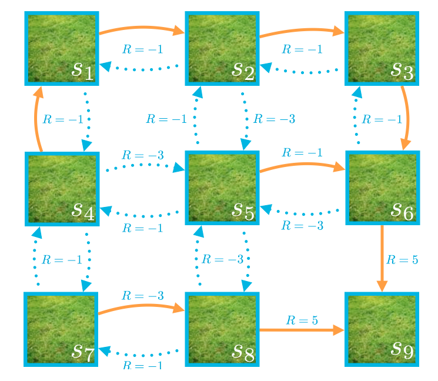

The policy $\pi$ is given by, $\pi(s_1)=right$, $\pi(s2)=right$ etc. Recall the $s_9$ is a terminal state, so $v_{\pi}(s_9)=0$ and assume that $\gamma=1$. recall that  $\pi(s_1)$ is the state value function.

What is $v_{\pi}(s_4)​$ ? knowing that  $v_{\pi}(s_9)=0​$ we have,  $v_{\pi}(s_6)=5​$ then we can do $-1​$ at each step back, finally  $v_{\pi}(s_4)=1​$

## 6. optimality

We have on the right the grid from the quiz what we can notice is that value function for pi prime is always greater than the other one. As you can see with the circled numbers.

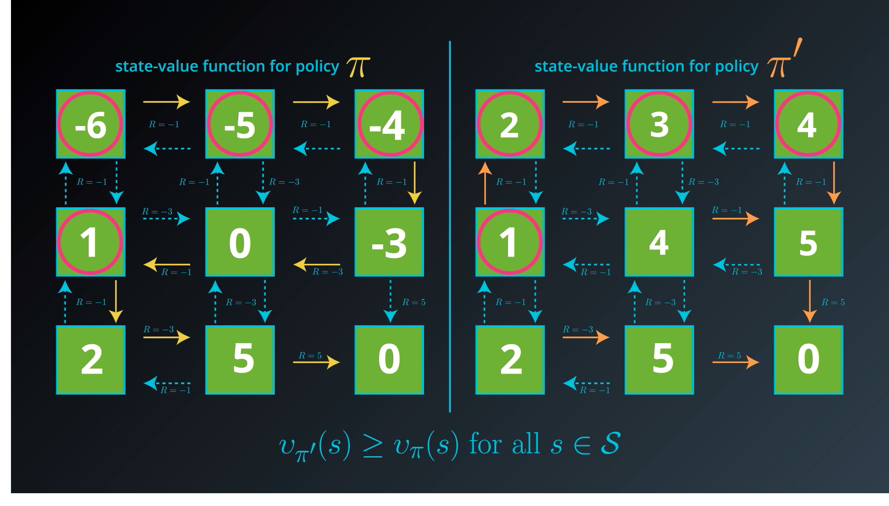

Our goal is to maximize the expected return, so the best policy will be in essence the one we are looking for, and actually the one from the quiz is the **optimal state-value function**

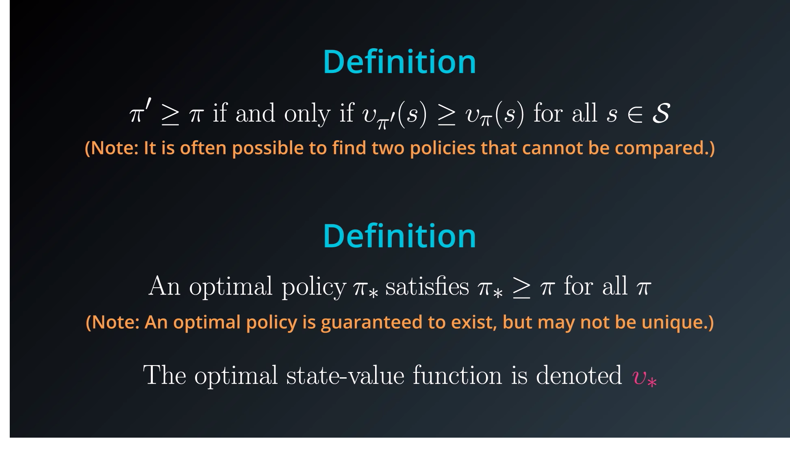

## 7. Action-value functions

With the **action-value function** we will take into account the actions and the state.

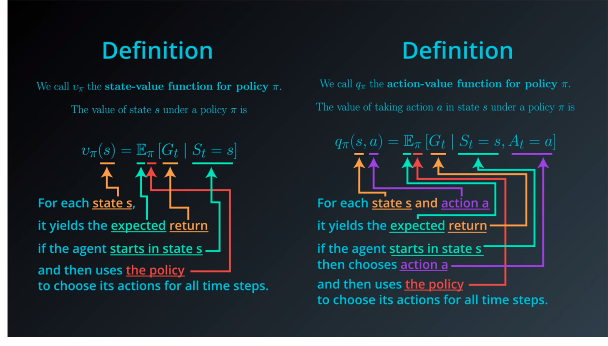


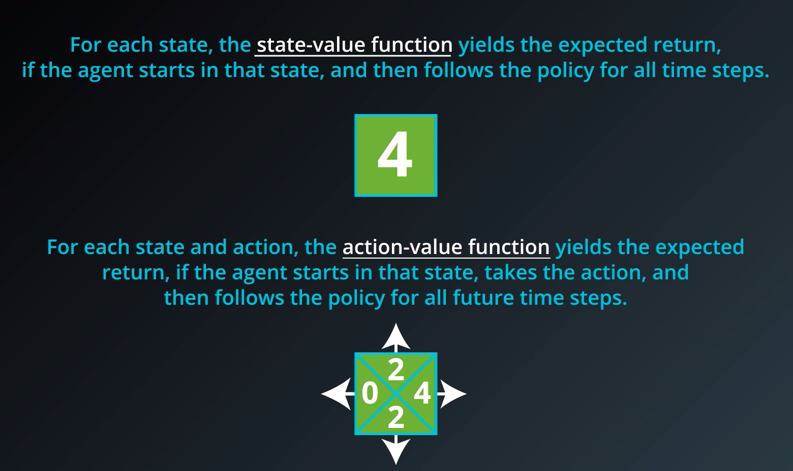

We will refer to the **optimal value-function** as $q_*$

#### Example:

-------

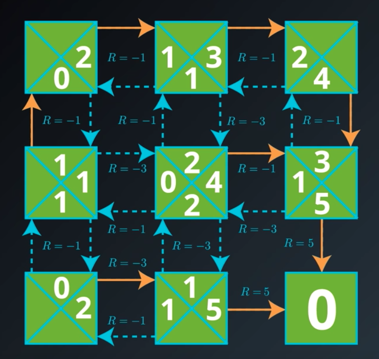

## 8. optimal policies

We will say that we know the optimal value-function $q_*$ but not the optimal policy $\pi_*$ how to find it ? We will consider the example from the quiz, but we will remove the orange arrows that are the optimal policy.

If start at the state on the top left, we just take the biggest value $2$ we follow this arrow, then $3$ we create an arrow, then $4$ and so on. 

We will only get a problem with the ones on the left full of ones. 


