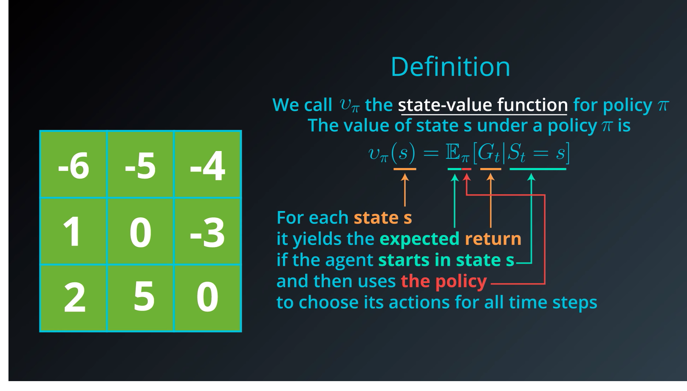

# Lesson 3: The RL Framework: The Solution

## 1. Introduction

This lesson covers material in **Chapter 3** (especially 3.5-3.6) of the textbook. This lesson will be more technical that in the last lesson.

## 2. Policies

We've seen that we use a Markov decision process or MDP as a formal definition of the problem that we'd like to solve with reinforcement learning. In this lesson,  we specify a formal definition for the solution to this problem. We can start to think of the solution as a series of actions that need to be learned by the agent toward the pursuit of a goal. As long as the agent learns an appropriate action response to any environment state that it can observe, we have a solution to our problem. This motivates the idea of a **policy**:

**A deterministic policy** is a mapping:
$$
\pi : \mathcal{S} \rightarrow \mathcal{A}
$$
**A stochastic policy** is a mapping:
$$
\pi : \mathcal{S} \times \mathcal{A} \rightarrow [0,1] \\ 
\pi(a \mid s) = \mathbb{P}(A_t=a \mid S_t=s)
$$
**Example:**

We give a set of example of deterministic and stochastic policy:


We can also write the Deterministic Policy as a Stochastic Policy as written below: (we will have probability of zero or one)


## 3. Gridworld example

To understand how to go about searching for the best policy, it will help to have a running example. So consider a world which is primarily composed of nice patches of grass, but two out of the nine locations in the world have large mountains. The agent can only move up, down, left or right; its goal is to geet to the bottom right hand corner of the world as quickly as possible. We'll think of this as an episodic task where an episode finishes when the agent reahes the goal


When the agent reaches the goal it gets a reward of five, and the episodee ends. Otherwise for a mountain the reward will be $R=-3$ otherwise it is $R=-1$ 

## 4. state-value functions

We're looking with this grid world example and looking for the best policy that leads us to the goal state as quickly as possible. So let's start with a very bad policy so we can work to improve it, specifically we'll look at a policy where the agent visists every state in this very roundabout manner.


Let's calculate the cumulative reward, we will set the discount rate to one, $\gamma=1$ then the return for the initial patch will be $-6$, then we change the starting point to the second patch we get $-5​$ and so on.

We will attach some notation and terminology to this process we just followed you can think of this grid of numbers as a function of the environment State for state it has a corresponding number and we refer to this function as the ```state value function```. 

For each state, the **state-value function** yields the expected return, if the agent started in that state, and then followed the policy for al time steps. More mathematically you write:



## 5. bellman equations


