# Lesson 4: Dynamic programming

## 1. Introduction

This lesson covers material in **Chapter 3** (especially 3.1-3.3) of the textbook.

## 2. An iterative method

Let's build off the grid world example again and investigate how we might determine the value function $v_{\pi}(s) $corresponding to a particular policy $\pi,~ \forall s \in \mathcal{S}$. At first we will enumerate the states, state $\mathcal{S}_1​$ is the state on the top left corner ...

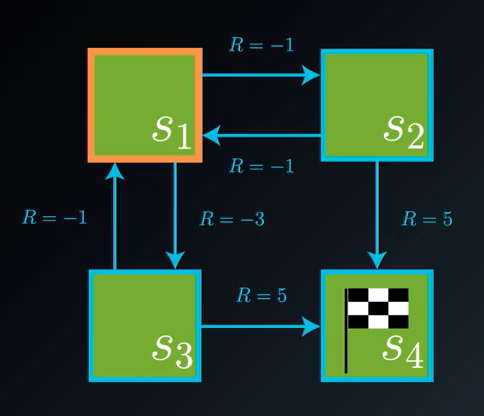

Say we're trying to evaluate the Stochastic policy where the agent selects actions uniformly from the set of possible actions. For example in state $\mathcal{S}_1$, we will give the same uniformly probability for the other states.
$$
\pi(right \mid s_1) = \frac{1}{2} \\
\pi(down \mid s_1) = \frac{1}{2} \\
$$
As a recall The Bellman expectation equation is:
$$
v_{\pi}(s) = \mathbb{E}_{\pi} [R_{t+1} + \gamma v_{\pi} (S_{t+1} \mid S_t=s)] = \sum_{a \in \mathcal{A}(s)} \pi(a \mid s) \sum_{s' \in \mathcal{S},~ r \in \mathcal{R}} p(s', r \mid s,a)(r+ \gamma v_{\pi}(s'))
$$
So we can calculate for state $\mathcal{S}_1$ the **value-function**: (with the corresponding rewards of $R=-1,-3$)
$$
v_{\pi}(s_1) = \frac{1}{2} (-1 + v_{\pi}(s_2)) + \frac{1}{2} (-3 + v_{\pi}(s_3))
$$
This is just the bellman-equation. Continuing with state $\mathcal{S}_2,~\mathcal{S}_3,$
$$
v_{\pi}(s_2) = \frac{1}{2} (-1 + v_{\pi}(s_1)) + \frac{1}{2} (5 + v_{\pi}(s_4)) \\
v_{\pi}(s_3) = \frac{1}{2} (-1 + v_{\pi}(s_1)) + \frac{1}{2} (5 + v_{\pi}(s_4))
$$
And the value of state $\mathcal{S}_4​$ will always be zero because it is a terminal state
$$
v_{\pi}(s_4) = 0
$$
We then have a system of equations that we can solve to get the value of each state, we get those values:
$$
v_{\pi}(s_1)=0, ~~ v_{\pi}(s_2)=2, ~~ v_{\pi}(s_3)=2, ~~ v_{\pi}(s_4)=0, 
$$
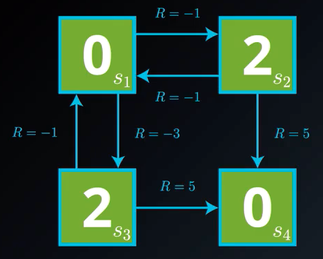

> The only problem here is that typically the state space is much larger so directly solving the system of equations is more difficult. 

**Solving with an Iterative Method:**

---

We start with a guess of the values of each state (like zero). Then we focus on one state, like for example $\mathcal{S}_1$. We will adapt the state value function to act as an update rule:
$$
V(s_1) \leftarrow \frac{1}{2} (-1 + V(s_2)) + \frac{1}{2} (-3 + V(s_3)) \\
V(s_1) \leftarrow \frac{1}{2} (-1 + 0) + \frac{1}{2} (-3 + 0) = -2
$$
Then we will do the same for the second state using the value $V(s_1)$:
$$
V(s_2) \leftarrow \frac{1}{2} (-1 + V(s_1)) + \frac{1}{2} (5 ) \\ 
V(s_2) \leftarrow \frac{1}{2} (-1 + -2) + \frac{1}{2} (5 ) =1
$$
This iterative Algorithm yields an estimate that converges to the true value function. 

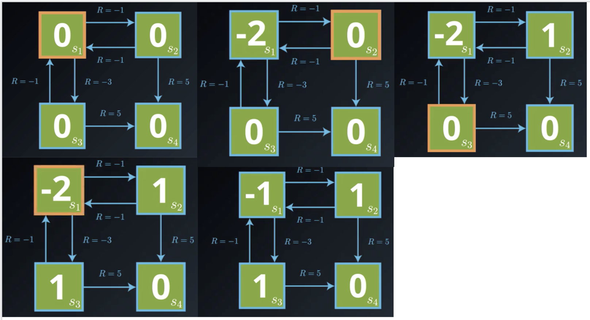

## 3. iterative policy evaluation

The algorithm we just saw is called **Iterative Policy Evaluation** and it assumes that the agent already has full and perfect knowledge of the MDP that characterizes the environment. Recall that it was based on the Bellman Expectation Equation for the State-Value Function:
$$
v_{\pi}(s) = \mathbb{E}_{\pi} [R_{t+1} + \gamma v_{\pi} (S_{t+1} \mid S_t=s)] = \sum_{a \in \mathcal{A}(s)} \pi(a \mid s) \sum_{s' \in \mathcal{S},~ r \in \mathcal{R}} p(s', r \mid s,a)(r+ \gamma v_{\pi}(s'))
$$
Which is basically a system of equation, we have one value function for all the states. As we have seen we can construct an iterative algorithm to solve this equation instead, we call, the **Update Rule for Iterative Policy Evaluation:**
$$
V(s) \leftarrow  \sum_{a \in \mathcal{A}(s)} \pi(a \mid s) \sum_{s' \in \mathcal{S},~ r \in \mathcal{R}} p(s', r \mid s,a)(r+ \gamma V(s'))
$$

What is nice is that as long as a few technical conditions are satisfied, this algorithm is guaranteed to converge to the value function for the policy. Now we can only attain true convergence and the limit of running this algorithm an infinite number of times, and that's not feasible in practice.

So we'll have to stop short of true convergence. And the question is, how can we tell when we've gotten close enough ? When you implement the algorithm you'll notice that the first few times the update step is applied, there are big changes to the value function. But eventually, you won't notice much change, that's the strong identication of almost convergence.

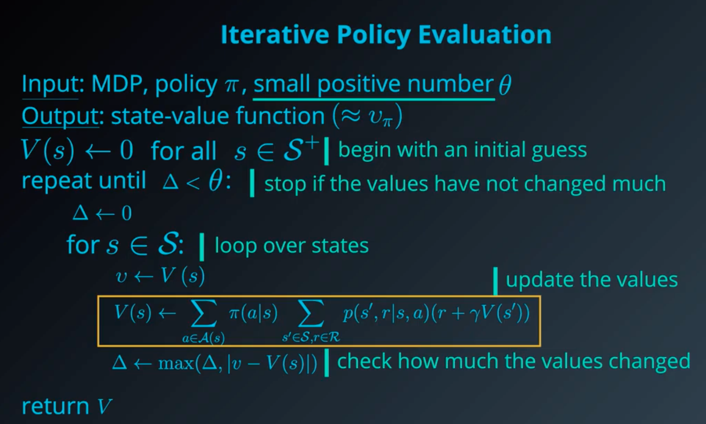

It's not at all intuitive that this algorithm should work the way it does. But here is the main idea behind what that update step is doing.

Remember that we loop over states and apply the update to one state at a time. And from each state, the agent could choose any of a number of possible actions that bring it to any of a number of potential next states. Then what we do is, look at the estimated value function for the parent state, along with the values of the successor state. And if we plug in those values to the Bellman equation, and it's not satisfied, what we'll do is, we'll change the value of the parent state so that the Bellman equation is satisfied. Then, we'll do the same for the second state and so on.

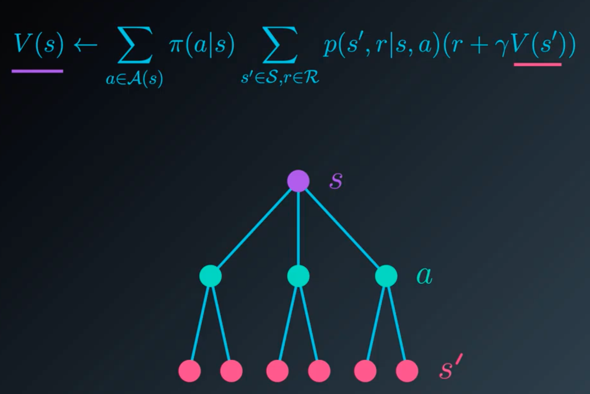

## 4. Action values

In a previous concept, you wrote your own implementation of iterative policy evaluation to estimate the state-value function $v_\pi​$ for a policy $\pi​$. In this concept, you will use the simple gridworld from the videos to practice converting a state-value function $v_\pi​$ to an action-value function $q_\pi​$.

Consider the small gridworld that we used to illustrate iterative policy evaluation. The **state-value function** for the equiprobable random policy is visualized below. With a **deterministic policy**.

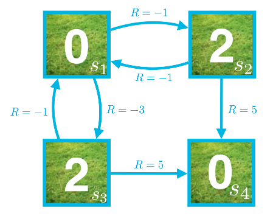

Which correspond to the **action-value function** for the same policy.

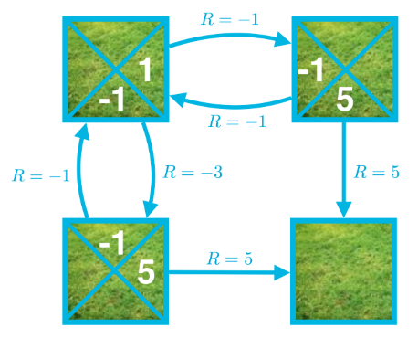

Like consider $q_\pi (s_1, right)​$. This action value can be calculated as:
$$
q_\pi (s_1, right) = -1 + v_{\pi}(s_2) = -1 +2 = 1
$$
As we can see we first have to do one full iteration of iterative policy algorithm to set the value-function, that we will use next. 

**For More Complex Environments - stochastic policy:**

---

In the simple grid world example, the environment is **deterministic**. In other word, after the agent selects an action, the next state and reward are 100% guaranteed and non-random. For deterministic environments:
$$
p(s',r \mid s,a) \in \{0,1 \}
$$
In general, the environment need not be deterministic, and instead may be **stochastic**. In this case, when the agent is in state $s$ and takes action $a$, the probability of each posible next state $s'$ and reward $r$ is given by $p(s', r \mid s, a)$

## 5. policy improvement

Nothing much to say, we will just plug the update value of the policy at end of the loop to the new value function that we will update again

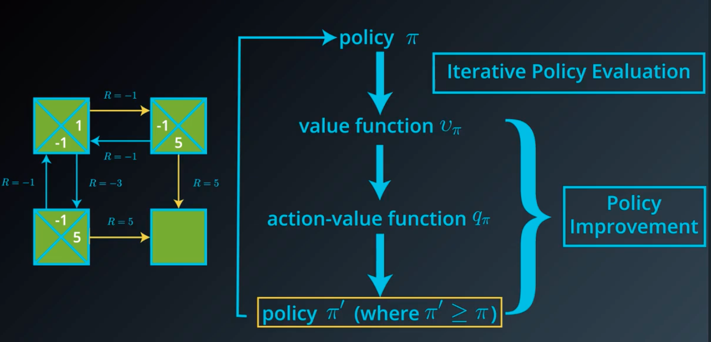

We have the following algorithm:

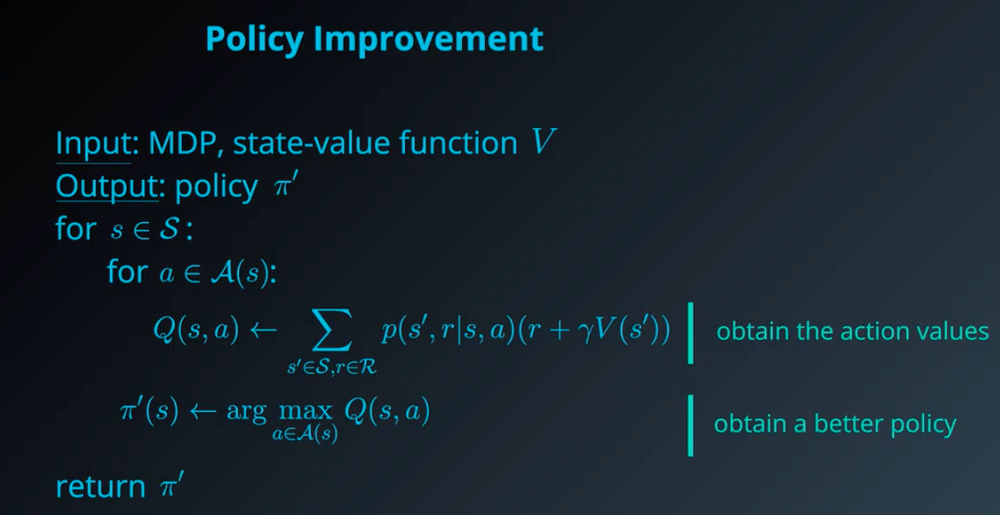

## 6. policy iteration

Basically what we just saw before but with a name

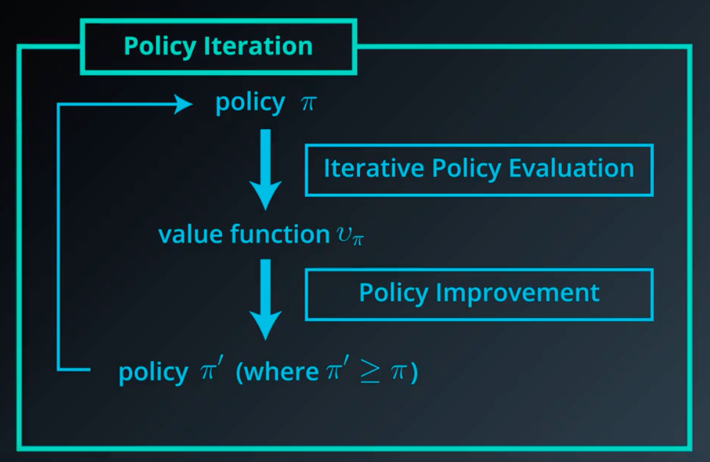

then

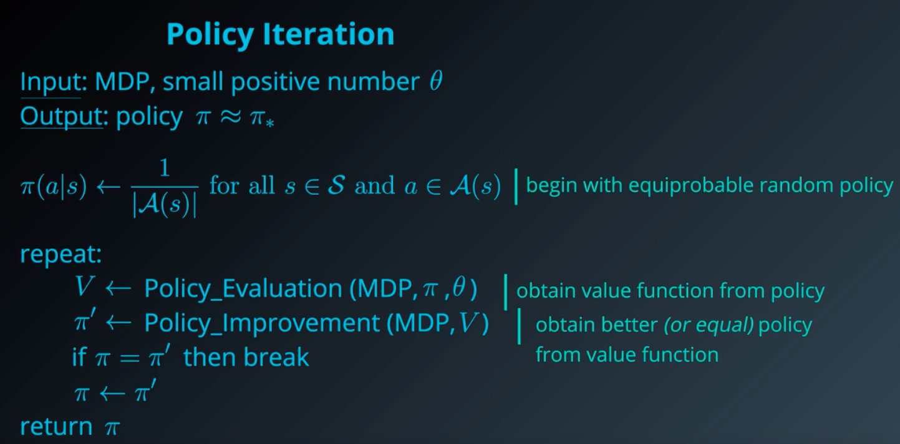

## 7. truncated policy iteration - variation of policy iteration 

## 8. Value iteration - variation of policy iteration 

