# Lesson 5: Monte carlo methods

## 1. Introduction

This lesson covers material in **Chapter 5** (especially 5.1-5.6) of the textbook.

## 2. MC prediction: state values

In this lesson we will confine our attention to episodic tasks where the interaction stops at some time step $T$ when the agent encounters a terminal state and we refer to the sequence **as an episode**
$$
S_0, A_0, R_1, A_1, R_2, ..., S_T
$$
The agent goal is to find $\pi$ that maximize:
$$
\mathbb{E}_{\pi} \Big[ \sum_{t=1}^{T} R_t \Big]
$$
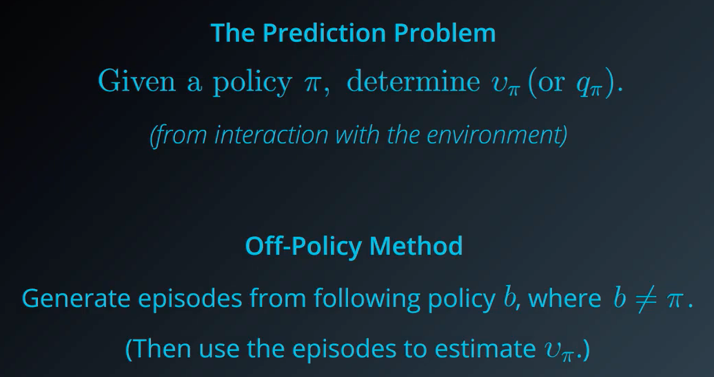

To reduce some complexity we will use the **On-Policy Method** instead for the moment.

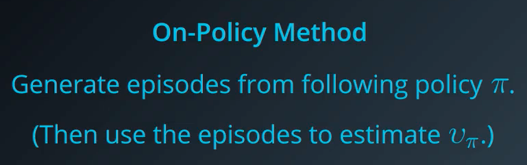

For motivation we will see an example, a very small frozen world, if the agent lands at the state $Z$ the episode end. The world will be slippery, if the agent choose the action down, there are some positive probability to go up or stay where it is. 
Say we would like to evaluate the policy or going up or down 

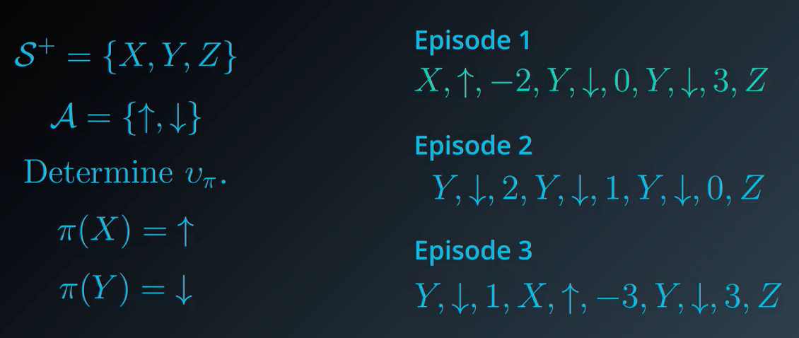

We can calculate the value-function:

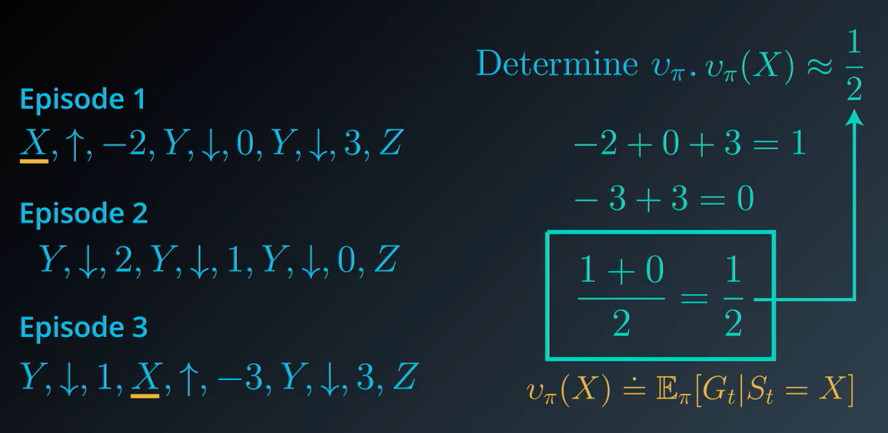

As we can see for $Y$ the situation might be a bit more complicated, actually we will define two types of algorithm: - First-visit MC method:

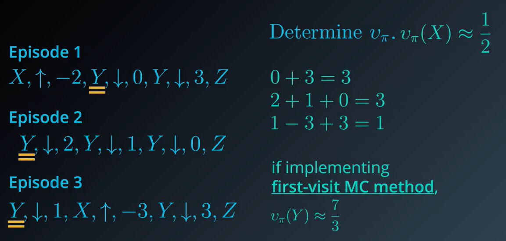

And the second one: **every-visit MC method**

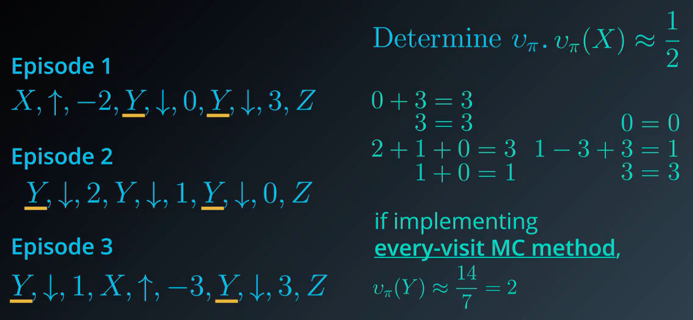

## 3. MC prediction: action values

Our next step in the Dynamic Programming setting was to convert $v_{\pi}$ to $q_{\pi}$, as a recall we used the following equation:
$$
q_{\pi}(s,a) = \sum_{s' \in \mathcal{S}, ~r \in \mathcal{R}} p(s',r \mid s,a) (r + \gamma v_{\pi}(s'))
$$
Unfortunately **we won't be able to use this formula**, we use to know the one-step dynamic $p(s',r\mid s,a)$ which was known to the agent but in the RL setting the agent doesn't know this setting. 

Instead of looking at each state, we will look at each (state, value) pair and average them as before after doing the calculation.

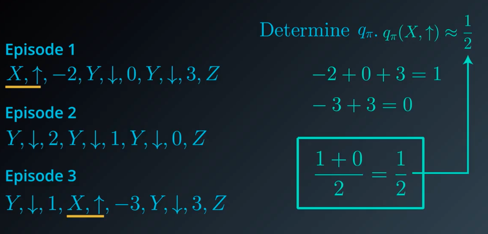

We do the same for Y, with the **first-visit MC method** or **every-visit MC method**, anyway with more episodes they should converge to the same value.

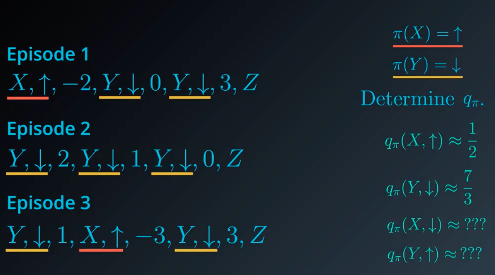

One of the problem we have, is that we are actually following a deterministic policy, as we can see when in the state $X$ we only have one possible action, so it won't be possible to calculate the $???$ value on the bottom right.

One of the solution is to not consider a deterministic policy

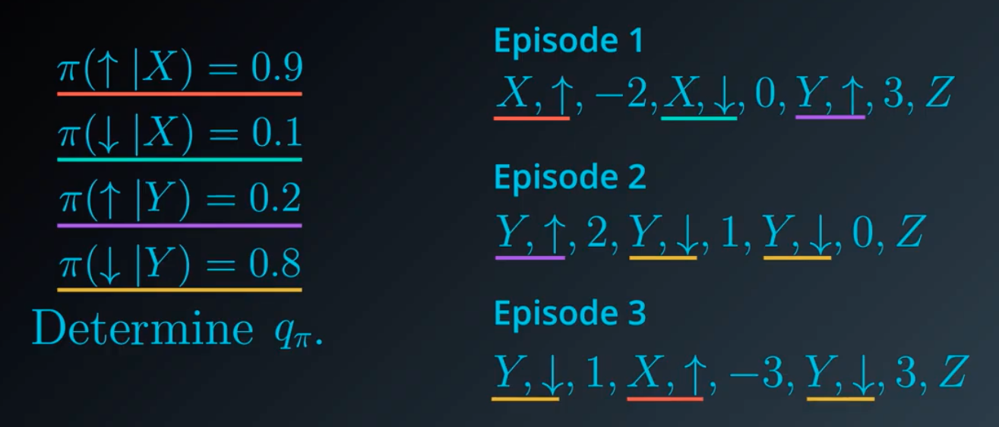

## 4. generalized policy iteration

Now that we have seen the **Prediction Problem** we will focus on the **Control Problem**

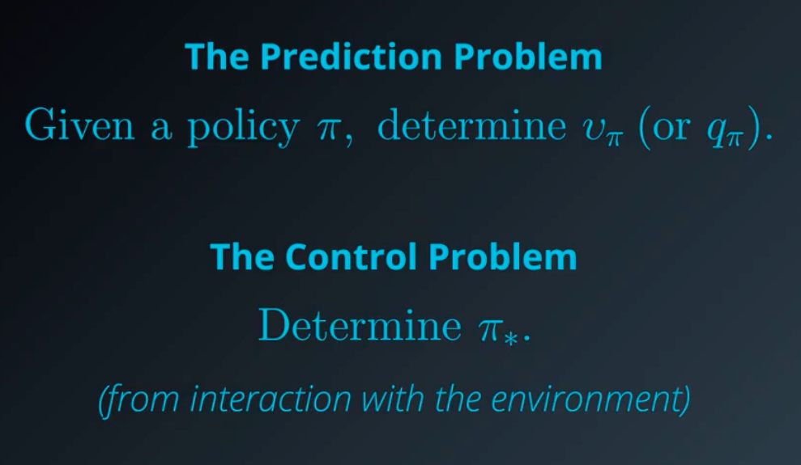

We have seen three general algorithms in the previous setting :

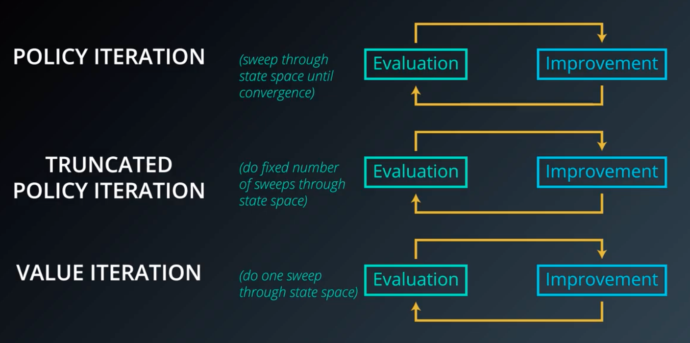

Even if those algorithms are different it will be useful to find what they have in common, and we will use the term **Generalized Policy Iteration** to refer to this general process

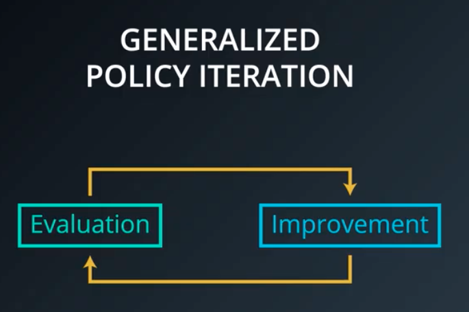

Our Monte Carlo control algorithm will draw inspiration from generalised policy iteration. We'll begin with the policy evaluation step. We've already somewhat adressed how to accomplish this, in the blacjack game, the agent needs to play blackjack about 5,000 times to get a good estimate of the value function. 

In the context of policy iteration, this seems like way too long to spend evaluating a policy before trying to improve it. Maybe it would make more sense to improve the policy after every individual game of blackjack. 

We could start by initialising the value of each state action pair to zero and some starting policy to generate an episode. 

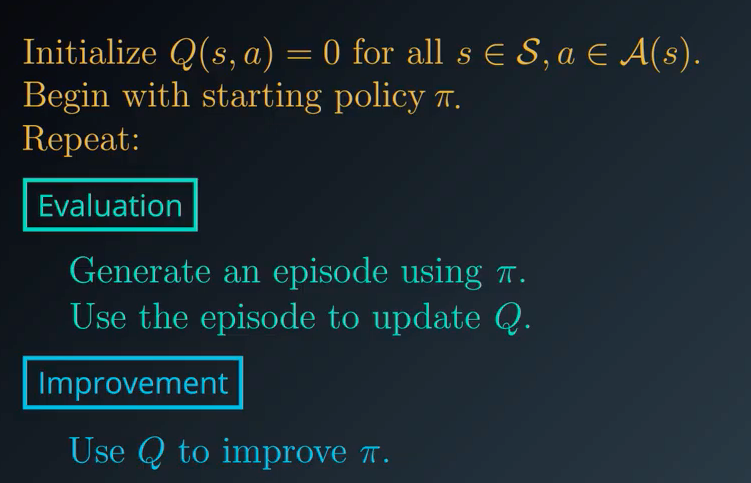

Recall that when we calculated $v_{\pi}$, we calculcated the return for each episode, and then we took the average, we will denote $x_i$ all of those returns our value function estimate will be denoted by:

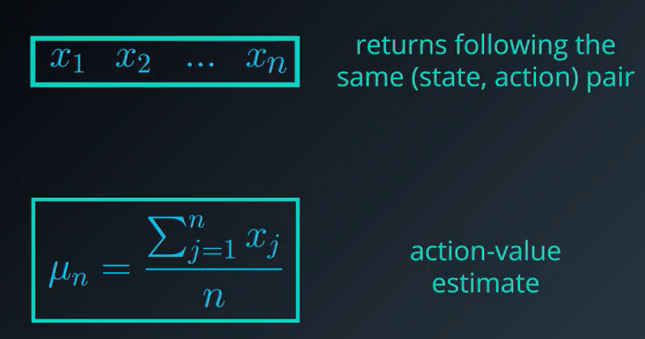 

So instead of calculating at the end of the episode, we will update the estimate of the value function this way:

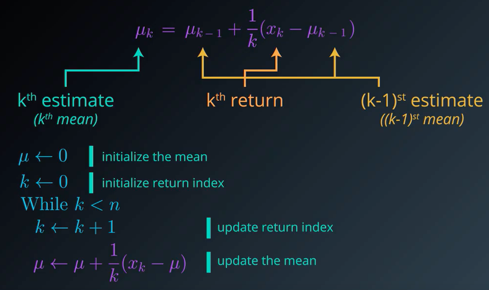

## 5. mc control: policy evaluation

What we have just seen can only estimate a **single action-value pair**, we need to generalise this idea.

#### Policy Evaluation (the green part)

----

We could start by initialising the value of each state action pair to zero, denoted $Q(s,a)$. $N(S_t, A_t)$ is used in accordance with the update of the mean we just saw, it is the number of time we visited each pair

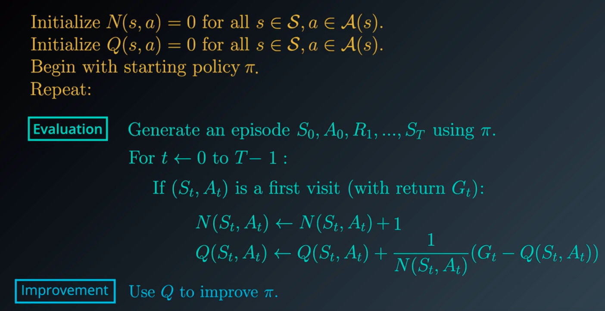

#### Policy Improvement (the blue part)

----

So given an action-value function, how may we use it to propose a policy. Is it possible to just copy the algorithm from the dynamic programming case ?
$$
\pi(s) \leftarrow \underset{a \in \mathcal{A}(s)}{arg~max~} Q(s, a) ~~\forall s \in S
$$
In other words, for each state we just pick the action with the highest value. Actually it is kind of a valid approach here, we'll just need to do some amendments. To see this let's look at an example:

**Example:**

---

Let's say the agent starts opening Door B, he gets a rewards of 0, then Door A, he gets a reward of 1, by using a greedy approach he still keeps opening Door A, he gets 3, 1 and so on … And never open the Door B because of the first value he got. This is not a good approach, if the agent opened the Door B a second time he could have gotten a 100 reward.

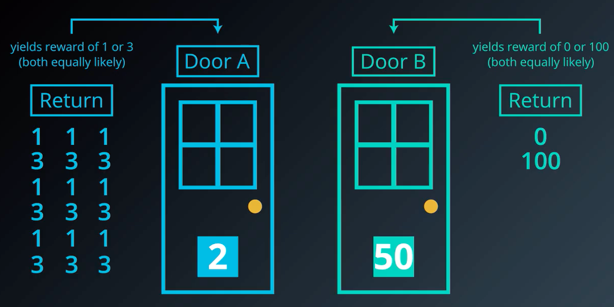

So instead of always doing a greedy policy, we will construct stochastic policy, where we will very often take the greedy policy, but with a very small probability we will choose the second one, a non greedy action. We will set a $\varepsilon$ value

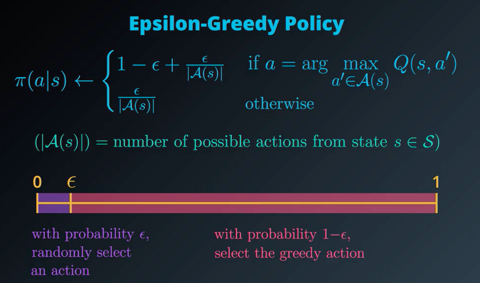

We can finally adjust the algorithm:

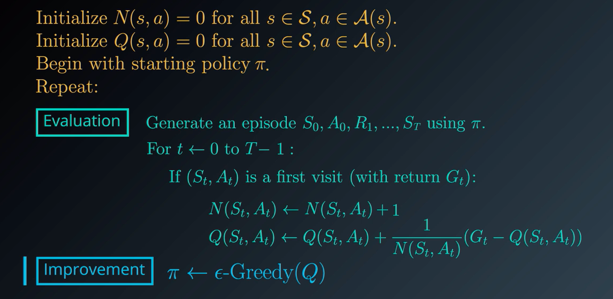

## 6. mc control: constant-alpha

Currently our update step for policy evaluation, generate an episode for each state action pair that was visited, we calculate the corresponding return $G_t$ that follows, then we use that return to get an updated estimate.
$$
Q(S_t, A_t) \leftarrow Q(S_t, A_t) + \frac{1}{N(S_t, A_t)} (G_t - Q(S_t, A_t))
$$
We're going to look at this update step a bit closer with the aim of improving it. You can think of it as first calculating the difference between the most rectently sampled return $G_t$ and the corresponding value of the state action pair $Q(S_t, A_t)$ we will denote:
$$
\delta_t := G_t - Q(S_t, A_t) 
$$
We can think of it as an error term, it is: " **what the return actually was** minus **the return that we expect** "

If $\delta_t \gt  0$ : it means the return that we received is more than what the value function expected in this case the action value is too low so we use this update step to increase the estimate. So we $increase~Q(S_t, A_t)$

If $\delta_t < 0$: it means the return is higher than what the action value function expected so it makes sense to take into account this new evidence and $decrease~(Q_t, A_t)$.

Currently the algorithm $decrease$ or $increase$ it by an amount proportional to $\frac{1}{N(S_t, A_t)}$, which is the number of times that we visited the state action pair already, so the first few times we visit the pair the change is likely to be quite large but at future time points the changes get smaller and smaller.

With this in mind we will change the algorithm step size:
$$
Q(S_t, A_t) \leftarrow Q(S_t, A_t) + \alpha (G_t - Q(S_t, A_t))
$$

> The parameter $\alpha$ ensures that the returns that come later are more emphasised than those that arrived earlier in this way the agent will mostly trust the most recent returns and gradually forget about those that came in the past. This is quite important because the policy is constantly changing

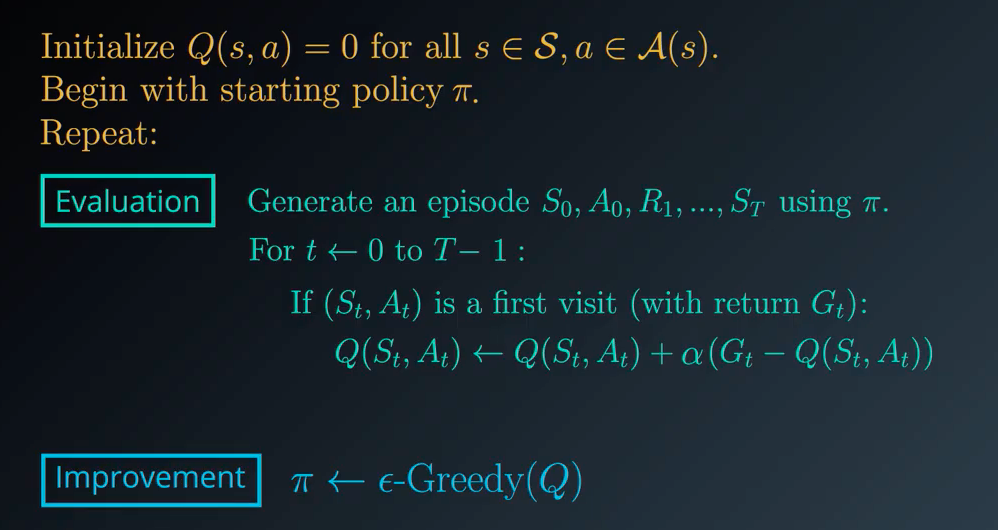

