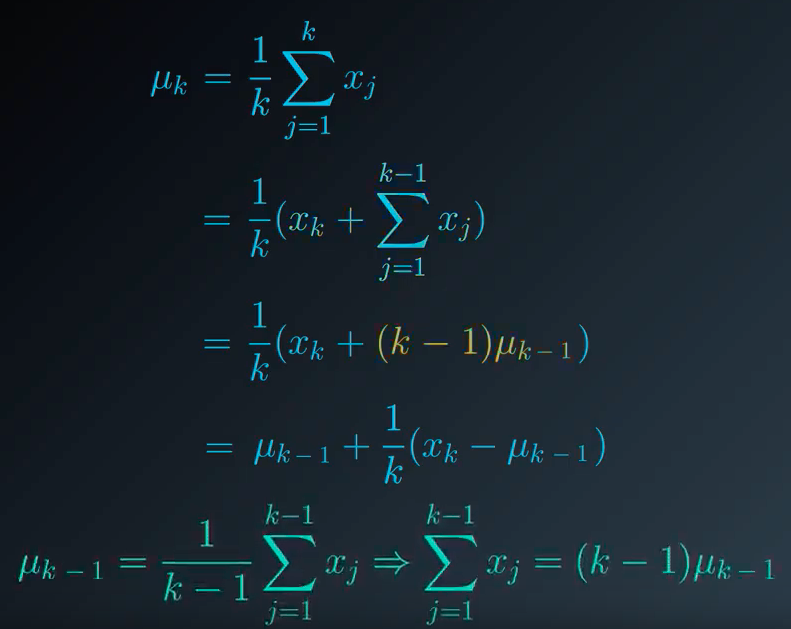
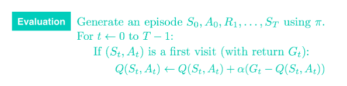

# Lesson 5: Monte carlo methods

## 1. Introduction

This lesson covers material in **Chapter 5** (especially 5.1-5.6) of the textbook.

## 2. MC prediction: state values

In this lesson we will confine our attention to episodic tasks where the interaction stops at some time step $T$ when the agent encounters a terminal state and we refer to the sequence **as an episode**
$$
S_0, A_0, R_1, A_1, R_2, ..., S_T
$$
The agent goal is to find $\pi$ that maximize:
$$
\mathbb{E}_{\pi} \Big[ \sum_{t=1}^{T} R_t \Big]
$$


To reduce some complexity we will use the **On-Policy Method** instead for the moment.


For motivation we will see an example, a very small frozen world, if the agent lands at the state $Z$ the episode end. The world will be slippery, if the agent choose the action down, there are some positive probability to go up or stay where it is. 
Say we would like to evaluate the policy or going up or down 


We can calculate the value-function:


As we can see for $Y$ the situation might be a bit more complicated, actually we will define two types of algorithm: - First-visit MC method:


And the second one: **every-visit MC method**


## 3. MC prediction: action values

Our next step in the Dynamic Programming setting was to convert $v_{\pi}$ to $q_{\pi}$, as a recall we used the following equation:
$$
q_{\pi}(s,a) = \sum_{s' \in \mathcal{S}, ~r \in \mathcal{R}} p(s',r \mid s,a) (r + \gamma v_{\pi}(s'))
$$
Unfortunately **we won't be able to use this formula**, we use to know the one-step dynamic $p(s',r\mid s,a)$ which was known to the agent but in the RL setting the agent doesn't know this setting. 

Instead of looking at each state, we will look at each (state, value) pair and average them as before after doing the calculation.


We do the same for Y, with the **first-visit MC method** or **every-visit MC method**, anyway with more episodes they should converge to the same value.


One of the problem we have, is that we are actually following a deterministic policy, as we can see when in the state $X$ we only have one possible action, so it won't be possible to calculate the $???$ value on the bottom right.

One of the solution is to not consider a deterministic policy


### Mini Project: MC (Part 2)

## 4. generalized policy iteration

### 4.1 Overview

Now that we have explored the **Prediction Problem** we will focus on the **Control Problem**, how might an agent learn an optimal policy with interaction with the environment. To understand the algorithm for Monte-Carlo Control, it will prove useful to first revisit what we did in the Dynamic programming setting.


In that setting, the first control algorithm we examined was Policy Iteration, truncated policy iteration and value iteration:


Even if those algorithms are different it will be useful to find what they have in common, and we will use the term **Generalized Policy Iteration** to refer to this general process without imposing any constraints on how many sweeps of policy evaluation there are or how close it is allowed to run to convergence.


### 4.2 MC Control: Incremental Mean

Our Monte Carlo control algorithm will draw inspiration from generalized policy iteration. We'll begin with the policy evaluation step. We've already somewhat adressed how to accomplish this, in the blacjack game, the agent needs to play blackjack about 5,000 times to get a good estimate of the value function. 

In the context of policy iteration, this seems like way too long to spend evaluating a policy before trying to improve it. Maybe it would make more sense to improve the policy after every individual game of blackjack. 

We could start by initialising the value of each state action pair to zero and some starting policy to generate an episode. When an episode finishes we can update the value-function, then it could be used to improve the policy and so on. **To do that, we have to change the evaluation step**


Recall that when we calculated $v_{\pi}$, we calculcated the return for each episode, and then we took the average,

 

As a more general case, say we visited the state action pair some number of times we will denote $x_i$ all of those returns. Then our action-value estimate is calculated as the average of those values, we will denote it with $\mu_n$, we can iteratively update the estimate after every visit:

 

So instead of calculating at the end of the episode, we will update the estimate of the value function this way:

 

Then we get the final formula


### 4.2 MC Control: Policy Evaluation

What we have just seen can only estimate a **single action-value pair**, we need to generalise this idea.

#### Policy Evaluation (the green part)

----

We could start by initialising the value of each state action pair to zero, denoted $Q(s,a)$. $N(S_t, A_t)$ is used in accordance with the update of the mean we just saw, it is the number of time we visited each pair


### 4.3 MC Control: Policy Improvement

----

So given an action-value function, how may we use it to propose a policy. Is it possible to just copy the algorithm from the dynamic programming case ?
$$
\pi(s) \leftarrow \underset{a \in \mathcal{A}(s)}{arg~max~} Q(s, a) ~~\forall s \in S
$$
In other words, for each state we just pick the action with the highest value. Actually it is kind of a valid approach here, we'll just need to do some amendments. To see this let's look at an example:

**Example:**

---

Let's say the agent starts opening Door B, he gets a rewards of 0, then Door A, he gets a reward of 1, by using a greedy approach he still keeps opening Door A, he gets 3, 1 and so on … And never open the Door B because of the first value he got. This is not a good approach, if the agent opened the Door B a second time he could have gotten a 100 reward.


So instead of always doing a greedy policy, we will construct a stochastic policy, where we will very often take the greedy policy, but with a very small probability we will choose the second one, a non greedy action. We will set a $\varepsilon$ value


We can finally adjust the algorithm:


### 4.4 Exploration vs Exploitation

**Setting the Value of $\epsilon$, in theory:**

---------

It makes sense for the agent to begin its interaction with the environment by favoring **exploration** over **exploitation**. After all, when the agent knows relatively little about the environment's dynamics, it should distrust its limited knowledge and **explore**, or try out various strategies for maximizing return. With this in mind, the best starting policy is the equiprobable random policy, as it is equally likely to explore all possible actions from each state. You discovered in the previous quiz that setting $\epsilon = 1$ yields an $\epsilon$-greedy policy that is equivalent to the equiprobable random policy.

At later time steps, it makes sense to favor **exploitation** over **exploration**, where the policy gradually becomes more greedy with respect to the action-value function estimate. After all, the more the agent interacts with the environment, the more it can trust its estimated action-value function. You discovered in the previous quiz that setting $\epsilon = 0$ yields the greedy policy (or, the policy that most favors exploitation over exploration).

Thankfully, this strategy (of initially favoring exploration over exploitation, and then gradually preferring exploitation over exploration) can be demonstrated to be optimal.

### 4.5 Greedy in the Limit with Infinite Exploration (GLIE)

-------

In order to guarantee that MC control converges to the optimal policy $\pi_*$, we need to ensure that two conditions are met. We refer to these conditions as **Greedy in the Limit with Infinite Exploration (GLIE)**. In particular, if:

* every state-action pair $s, a$ (for all $s\in\mathcal{S}$ and $a\in\mathcal{A}$) is visited infinitely many times, and

* the policy converges to a policy that is greedy with respect to the action-value function estimate $Q$,

then MC control is guaranteed to converge to the optimal policy (in the limit as the algorithm is run for infinitely many episodes). These conditions ensure that:

* the agent continues to explore for all time steps, and
* the agent gradually exploits more (and explores less).

One way to satisfy these conditions is to modify the value of $\epsilon$ when specifying an $\epsilon$-greedy policy. In particular, let $\epsilon_i$ correspond to the *i*-th time step. Then, both of these conditions are met if:

* $\epsilon_i > 0$ for all time steps *i*, and
* $\epsilon_i$ decays to zero in the limit as the time step i*i* approaches infinity (that is, $\lim_{i\to\infty} \epsilon_i = 0$).

For example, to ensure convergence to the optimal policy, we could set $\epsilon_i = \frac{1}{i}$. (You are encouraged to verify that $\epsilon_i > 0$ for all $i$, and $\lim_{i\to\infty} \epsilon_i = 0$)

### 4.6 Setting the value of $\epsilon$, in Practice :

------

As you read in the above section, in order to guarantee convergence, we must let $\epsilon_i$ decay in accordance with the GLIE conditions. But sometimes "guaranteed convergence" *isn't good enough* in practice, since this really doesn't tell you how long you have to wait! It is possible that you could need trillions of episodes to recover the optimal policy, for instance, and the "guaranteed convergence" would still be accurate!

> Even though convergence is **not** guaranteed by the mathematics, you can often get better results by either:
>
> - using fixed $\epsilon$, or
> - letting $\epsilon_i$ decay to a small positive number, like 0.1.

This is because one has to be very careful with setting the decay rate for $\epsilon$; letting it get too small too fast can be disastrous. If you get late in training and $\epsilon$ is really small, you pretty much want the agent to have already converged to the optimal policy, as it will take way too long otherwise for it to test out new actions!

As a famous example in practice, you can read more about how the value of $\epsilon$ was set in the famous DQN algorithm by reading the Methods section of [the research paper](https://storage.googleapis.com/deepmind-media/dqn/DQNNaturePaper.pdf):

> *The behavior policy during training was epsilon-greedy with epsilon annealed linearly from 1.0 to 0.1 over the first million frames, and fixed at 0.1 thereafter.*

When you implement your own algorithm for MC control later in this lesson, you are strongly encouraged to experiment with setting the value of $\epsilon$ to build your intuition.

### Mini Project: MC (Part 3)


## 5. MC Control: Constant-alpha

### 5.1 Algorithm

Currently our update step for policy evaluation, generate an episode for each state action pair that was visited, we calculate the corresponding return $G_t$ that follows, then we use that return to get an updated estimate.
$$
Q(S_t, A_t) \leftarrow Q(S_t, A_t) + \frac{1}{N(S_t, A_t)} (G_t - Q(S_t, A_t))
$$
We're going to look at this update step a bit closer with the aim of improving it. You can think of it as first calculating the difference between the most rectently sampled return $G_t$ and the corresponding value of the state action pair $Q(S_t, A_t)$ we will denote:
$$
\delta_t := G_t - Q(S_t, A_t) 
$$
We can think of it as an error term, it is: " **what the return actually was** minus **the return that we expect** "

* If $\delta_t \gt  0$ : it means the return that we received is more than what the value function expected in this case the action value is too low so we use this update step to increase the estimate. So we $increase~Q(S_t, A_t)$

* If $\delta_t < 0$ : it means the return is higher than what the action value function expected so it makes sense to take into account this new evidence and $decrease~Q(S_t, A_t)$.

Currently the algorithm $decrease$ or $increase$ it by an amount proportional to $\frac{1}{N(S_t, A_t)}$, which is the number of times that we visited the state action pair already, so the first few times we visit the pair the change is likely to be quite large but at future time points the changes get smaller and smaller. When we have the 999 return getting the 1000 return is not going to change much.

With this in mind we will change the algorithm step size, with a constant step size:
$$
Q(S_t, A_t) \leftarrow Q(S_t, A_t) + \alpha (G_t - Q(S_t, A_t))
$$

> The parameter $\alpha$ ensures that the returns that come later are more emphasised than those that arrived earlier in this way the agent will mostly trust the most recent returns and gradually forget about those that came in the past. This is quite important because the policy is constantly changing, with every step it is becoming more optimal


We recall that we used an **Incremental mean** algorithm:

```
mu <- 0
k <- 0
while k < n
	k <- k + 1
	mu <- mu + 1/k (x_k - mu)
```

We will update it with our new alpha, we call it **forgetful_mean**

```
mu <- 0
k <- 0
while k < n
	k <- k + 1
	mu <- mu + alpha * (x_k - mu)
```


### 5.2 Setting the value of $\alpha$

Remember that the ```forgetful_mean``` function is closely related to the **Evaluation** step in constant-$\alpha$ MC control. You can find the associated pseudocode below



Before moving on to the next concept, use the above coding environment to verify the following facts about about how to set the value of $\alpha$ when implementing constant-$\alpha$ MC control.

* You should always set the value for $\alpha$ to a number greater than zero and less than (or equal to) one.
  * If $\alpha=0$, then the action-value function estimate is never updated by the agent.
  * If $\alpha = 1$, then the final value estimate for each state-action pair is always equal to the last return that was experienced by the agent (after visiting the pair).

* Smaller values for $\alpha$ encourage the agent to consider a longer history of returns when calculating the action-value function estimate. Increasing the value of $\alpha$ ensures that the agent focuses more on the most recently sampled returns.

Note that it is also possible to verify the above facts by slightly rewriting the update step as follows:
$$
Q(S_t,A_t)←(1−\alpha)Q(S_t,A_t)+ \alpha G_t
$$
where it is now more obvious that $\alpha$ controls how much the agent trusts the most recent return $G_t$ over the estimate $Q(S_t,A_t)$ constructed by considering all past returns.

**IMPORTANT NOTE**: It is important to mention that when implementing constant-$\alpha$ MC control, you must be careful to not set the value of $\alpha$ too close to 1. This is because very large values can keep the algorithm from converging to the optimal policy $\pi_*$. However, you must also be careful to not set the value of $\alpha$ too low, as this can result in an agent who learns too slowly. The best value of $\alpha$ for your implementation will greatly depend on your environment and is best gauged through trial-and-error.


### Mini Project: MC (Part 4)


