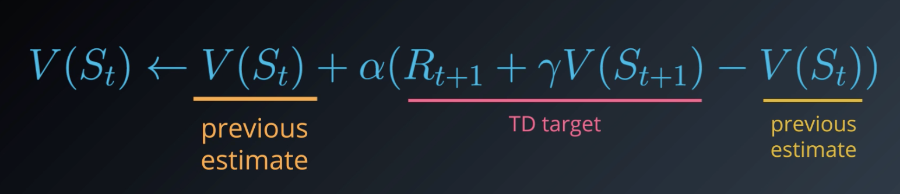

# Lesson 6: temporal-difference methods

## 1. Introduction

This lesson covers material in **Chapter 6** (especially 6.1-6.6) of the textbook. In this lesson we will learn " temporal-difference " or TD learning, real life is not an episodic task, we will need to come up with something else than what we previously saw.

If an agent is playing chess, instead of waiting until the end of an episode to see if it's won the game or not, it will at every move be able to estimate the probability that it's wining the game, or a self-driving car at every turn will be able to estimate if it's likely to crash, and if necessary, amend its strategy to avoid disaster.

Instead of waiting to update values when the interaction ends, it will amend its predictions at every step, and you'll be able to use it to solve both continuous and episodic tasks. It is also widely used in reinforcement learning and lies at the heart of many state-of-the-art algorithms that you see in the news today

## 2. OpenAI Gym: CliffWalkingEnv

In this lesson, you will write your own Python implementations of all of the algorithms that we discuss. While your algorithms will be designed to work with any OpenAI Gym environment, you will test your code with the CliffWalking environment.

In the CliffWalking environment, the agent navigates a 4x12 gridworld with - ```[3, 0]``` as the start at bottom-left  ```[3, 11]``` as the goal at bottom-right - ```[3, 1 .. 10]``` as the cliff at bottom-centre. The Cliff-walking task is based on [example 6.6 of the textbook](). And the [Github code](https://github.com/openai/gym/blob/master/gym/envs/toy_text/cliffwalking.py).

**Example: Cliff Walking** This gridworld example is a standard undiscounted, episodic task, with start and goal state, and the usual actions causing environment up, down, right and left. Reward is $-1$ on all transitions except those into the region marked "The Cliff". Stepping into this region incurs a reward of $-100​$ and sends the agent instantly back to the start.


## 2. TD prediction: TD(0)

We will continue with the trend of solving **The prediction Problem first** given a policy $\pi$ how do we evalute its value function $v_{\pi}$ ?

Let's build off how we did this in the previous lesson in our Monte Carlo approach. The agent interacted with the environment in episodes after an episode finished we looked at every state action pair in the sequence if it was a first visit we calculated the corresponding return and used it to update the action value and we did this for many many episodes.

> **It's important to note that this algorithm is a solution for the prediction problem as long as we never change the policy between episodes and as long as we run the algorithm for long enough**


Let's move our focus to the update step of the MC algorithm:
$$
Q(S_t, A_t) \leftarrow Q(S_t, A_t) + \alpha ( G_t - Q(S_t, A_t))
$$
And let's use an analogous equation for the value-function:
$$
V(S_t) \leftarrow V(S_t) + \alpha (G_t - V(S_t))
$$
**What we'll do is adapt this update step to come up with a new algorithm**. Remember that the main idea behind this line is that the value of any state is defined as the expected return that is likely to follow that state if the agent follows the policy so *averaging sampled return yields a good estimate at this point*. (we also recall the Bellman equation)
$$
\begin{align}
v_ \pi (s) &= \mathbb{E}_ \pi [G_t \mid S_t = s] \\
&= \mathbb{E}_ \pi [R_{t+1} + \gamma v_ \pi (S_{t+1}) \mid S_t = s]
\end{align}
$$


To motivate a slightly different update rule so we instead of averaginf sample returns we average the sampled value of this sum plus all the rest
$$
V(S_t) \leftarrow V(S_t) + \alpha (R_{t+1} + \gamma V (S_{t+1}) - V(S_t))
$$
What do we want that anyway ?

* First thing to notice is that we've removed any mention of the return that comes at the end of the episode and in fact this new update step gives us a way to update the state values after every time step

Let's see what happen at an arbitrary timestep $t$


**Before deatiling the algorithm in full let's talk a bit more about what this update step accomplishes**




We will rewrite the equation as:
$$
V(S_t) \leftarrow (1 - \alpha) V(S_t) + \alpha ( R_{t+1} + \gamma V(S_{t+1}))
$$
So when:

* $\alpha=1$ : the Value-function will be equal to the TD Target

$$
V(S_t) \leftarrow R_{t+1} + \gamma V(S_{t+1})
$$

* $\alpha = 0$ : we would completely ignore the target and keep the old estimate unchanged, this is not something that we'd ever want to do because then our agent would never learn **but it will prove to set alpha to a small number**. The **smaller alpha the less we trust the target when performing an update**

$$
V(S_t) \leftarrow V(S_t)
$$


We will call the full algorithm **One step Temporal Difference**; the " One Step " refers to the fact that we update the value function after any individual step


We begin by initializing the value of each state to zero then at everey time step the agent interacts with the environment choosing actions that are dictated by the policy and

**Continous tasks:**

-----

Immediately after receiving the reward and next state from the environment it updates the value function for the previous state 


**Episodic tasks: **

----

we need only check at every time step if the most recent state is a terminal state and if so we run the update step one last time to update the preceding state then we start a new episode but  as you can see the idea is basically the same.


## 3. TD Prediction: Action Values 

Earlier in this lesson we detailed an algorithm to calculate the state value function corresponding to a policy. Now we'll adopt that algorithm to instead return an estimate of the action value function.

Here, instead of updating the values after each state is received the agent will instead update the values after each action $s$ chosen but that's the only difference and if the agent interacts with the environment for long enough it will have a pretty good estimate of the action value function.


## 4. TD Control: Sarsa(0)

Now that we adressed the Prediction Problem we're ready to move on to control. 


So how might an agent determine an optimal policy ? we'll build off the algorithm that we use to estimate the action value function in that case after the action is selected the agent updates its estimate and it's important to note that the agent uses the same policy at every time step to select the actions. But now to adapt this to produce a control algorithm we will gradually change the policy so that it becomes more optimal at every time step.

It will be similar to the MC method where we selected an action by using a policy that's Epsilon greedy with respect to the current estimate of the action values. At the initial time step we begin by setting epsilon to 1 then $A_0$ and $A_1$ are chosen according to the equal probable random policy then at all future time steps after an action is chosen we update the action value function and create the corresponding epsilon greedy policy and as long as we provide appropriate values for epsilon the algorithm is supposed to converge.


The algorithm is known as Sarasa 0 also known as Sarasa for short; the name comes from the fact that each action value update uses a **S**tate **A**ction **R**eward next **S**tate next action

## 5. TD Control: Sarsamax


## 6. TD Control: Expected Sarsa


## 7. Analyzing Performance

