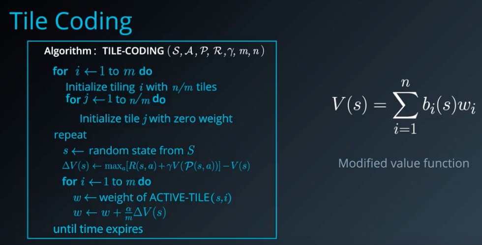
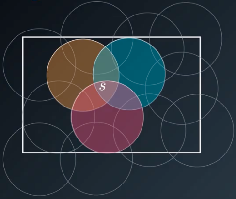
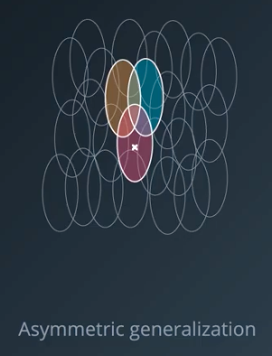

# Lesson 8: RL in Continuous Spaces

## 1. Deep Reinforcement learning

We recall some basic stuff and especially that there are two groups of algorithms:

* **Model-Based Learning (Dynamic Programming)**
  * Policy Iteration
  * Value Iteration
* **Model-Free Learning**
  * Monte Carlo Methods
  * Temporal-Difference Learning

**<u>Deep Reinforcement learning:</u>**

* RL in Continuous Spaces
* Deep Q-Learning
* Policy Gradients
* Actor-Critic Methods

**<u>Resources :</u>**

- [Sutton & Barto, 2nd Ed. - Part II: Approximate Solution Methods]()

## 2. Discrete vs Continuous Spaces

**<u>Discrete :</u>**

- We have a finite number of States and Actions
- It is easy to implement them:
  - For a deterministic policy: we can a map a dictionary where the key is the state and the value the "Value Function"
  - For a stochastic policy: We define a 2D array, with, the rows are the states and the columns are the actions.
- **Limitation :** In some algorithm we had to compute a $max$ which was easy considering we only have a few values. But in the continuous case, we will end up with an optimization problem

**<u>Continuous :</u>**

- We have, States: $s \in \R^n$ and $a \in \R^m$
- use-cases:
  - A robot throwing a dart on a target
  - A cleaner Robot
- To deal with continuous spaces we will have to use:
  - Discretization
  - Function approximation

## 3. Discretization

**<u>Example 1 - Cleaning robot :</u>**

We can mark off the cells where an object is present it is called **occupancy grid**. What we choosed might block the robot.

It is also possible to create a **Non-uniform Discretization**, if it is too small it may takes too much time to calculate a value function

Or we can apply a smaller non-uniform discretization. The main issue is that it will increase the total number of states, which in turn, may increase the time to calculate the value-function.

This is the same idea as quad trees or binary space partitioning

**<u>Example 2 - Fuel composition and Speed :</u>**

Our reward is inversely proportional to fuel consumption. The actions available to our agent are essentially switching up, or down. We can discretize speed into ranges, here the discretization is non-uniform we applied it to different length.

## 4. Tile Coding

If you have prior knowledge about the state space we can manually design an appropriate discretization scheme like in our gear switching example. We knew the relationship between fuel consumption and speed but in order to function in arbitrary environments **we need a more generic method.**

#### Tile Coding :

-----

One elegant approach for this is **tile coding** here the underlying state space is continuous and two-dimensional. We overlay multiple grids or tilings on top of the space each slightly offset from each other.

Any position $\mathcal{S}​$ in the state space can be coarsely identified by the tiles that it activates. If we assign a bit to each tile then we can represent our new discretized state as a bit vector, with one for the tiles that get activated and zeros elsewhere.

This is a very efficient representation but the genius lies in how the state value function is computed using the scheme instead of storing a separate value for each state $V(s)$. It is defined in terms of the bit vector $b_i(s)$ for that state an a weight for each tile $w_i$.

The **Tile Coding algorithm** in turn updates these weights iteratively this ensures nearby locations that share tiles also share some component of state value. Effectively smoothing the learned value function.

**Tile Coding** does have some drawbacks just like a simple grid based approach, we have to **manually select the tile sizes, their offsets, number of tilings …** ahead of time

#### Adaptative Tile Coding :

----

It starts with fairly large tiles and divides each tile into two whenever appropriate. **How do we know when to split ? We can use a heuristic for that**, basically we want to split the state space when we realise that we are no longer learning much with the current representation. That is when our value function isn't changing we can stop when we've reached some upper limit on number of split or some max iterations.

In order to figure out which tile to split we have to look at which one is likely to have the greatest effect on the value function. For this we need to keep track of sub-tiles and their projected weights. Then, we can pick the tile with the greatest difference between sub-tile weights.

There are many other Heuristics we can use but the main advantage of **Adaptative Tile Coding** is that it does not rely on a human to specify a discretisation ahead of time. The resulting state space is appropriately partitioned based on its complexity.

## 5. Coarse Coding

Coarse Coding is just like Tile Coding but it uses a sparser set of features to encode the sate space.

Imagine dropping a bunch of circle on a 2D continuous state space. Take any state $s$ which is a position in this space. And mark all the circles that it belongs to prepare a bit vector with a 1 for those circles and 0 for the rest. And that's your sparse coding representation of the state looking a 2D space helps us visualize the basic idea but it also extends to high dimensions where the circles become spheres and hyper-spheres.

There are some neat properties of Coarse-coding using :

* smaller circles results in less generalisation across the space. The learning algorithm has to work a bit longer but you have greater effective resolution 
* larger circles lead to more generalisation and in general a smoother value function you can use fewer large circles to cover the space thus reducing your representation but you would lose some resolution. 

It's not juste the size of these circles that we can vary, we can change them in other ways like making them taller or wider to get more resolution along one dimension versus the other.

In fact the samee technique generalises to pretty much any shape. In Coarse coding just like in Tile Coding our resulting state space representation is a binary vector. Think of each Tile or Circle as a feature 1 if it is active 0 if it is not. 

A natural extension to this idea is to use the distance from the center of each circle as a measure of how active that feature is. This measure or response can be made to fall off smoothly using a Gaussian curve centered on the circle which is know as a **Radial Basis Function**.

Of course, the resulting feature value will no longer be discrete so we'll end up with yet another continuous state vector but what is cool is that the number of features can be drastically reduced

## 6. Function Approximation

Sometimes we cannot discretize the whole space, we have to work fully in Continuous.

What we are after is the true Value-Function $v_{\pi}(s)$ or the Action-value-Function $q_{\pi}(s, a)$ which is typically smooth and continuous over the entire space. As we can imagine capturing this completely is practically infeasible except for some very simple problems.

Our best hope is **function approximation** because we don't know what the true underlying function is. A general way is to introduce a parameter vector $\bold w​$ that shapes the function. Our task then reduces to tweaking this parameter vector until we find the desired approximation.

Note that the approximation function can either map a state to its value or a state action pair to the corresponding $q$ value. Another form is where we map from one state to a number of different $q$ values one for each action all at once. This is especially useful for $Q-learning$ as we will see later.

**Let's focus on this first case : approximating a state value function**. Now we have this box here in the middle that's supposed to do some magic and convert the state $s$ and parameter vector $\bold w$ into a scalar value. The first thing we need to do is to ensure we have a vector representing the state. You state might already be a vector in which case you don't need to do anything. In general we'll define a transformation that converts any given state $s$ into a feature vector $\bold x$.

This also gives us more flexibility since we don't have to operate on the raw state values we can use any computer or derived feature instead. We now have a feature vector $\bold x$ and a parameter vector $\bold w$ and we want a scalar value. we can calculate the dot product

## 7. Linear Function Approximation

Let's take a closer look at the Linear Function Approximation and how to estimate the parameter vector $\bold w$. As we've seen already a linear function can be written as:

Let's assume we have initialised the weights randomly and computed the value of a state $\hat v (s, \bold w)$ , how would you tweak $\bold w$ to bring the approximation closer and closer to the true function ? Let's use gradient descent to find the optimal parameter vector. Firstly note that since $\hat v$ is a linear function its derivative with respect to $\bold w$ is what is written.

What we try to optimize is the difference between the true value-function and the approximation. To be more specific, RL domains are typically stochastic we write the expected value. We then calculate the gradient of the cost function for the error.

We can do the same for the Action-Value-function, we will be using the Gradient Descent as well:

And finally 

We can use Kernel Functions

## 8. Non-Linear Function Approximation

We can add a non-linearity exactly like with Neural Networks as we can see below:

