# Lesson 9: Deep Q-Learning

## 1. Introduction

Deep Q-Learning is an elegant algorithm that demonstrates how we can use neural networks to solve reinforcement learning problems. It has expanded the range of domains we can tackle especially those with large and continuous state spaces. 

We will first take a look at how Neural Networks can be used to represent value functions

Next we'll adapt the two main classes of model: Monte Carlo and Temporal difference learning to work with this new representation. You'll learn to harness the power of deep learning including convolutional and reccurent neural nets to teach computers tasks that seem almost impossible to learn from scratch like playing video games.

## 1. Neurals Nets as Value Functions

How do neural nets fits into Reinforcement Learning ? Remember how neural nets are touted as universal function approximaters. What if we use neural nets to represent our value function

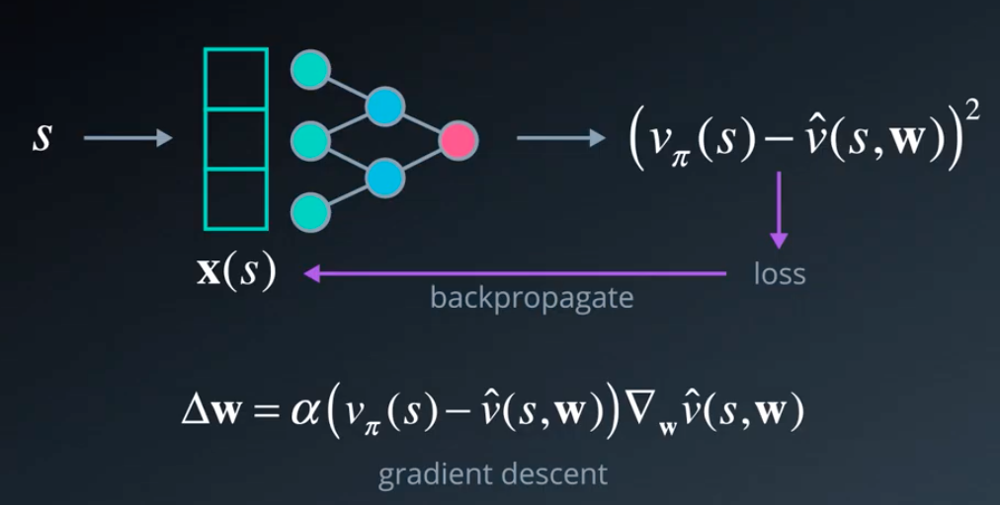

The question is how do we learn these parameters if we have a reference or target we're trying to reach for example $v_{\pi}$ provided by some oracle we can use the square difference as our error or loss. Then we can backpropagate to adjust the weight. One of the popular method is gradient descent where we update weights a small step away from the direction of error.

To train neural nets we need a way to figure out the loss and that's where our knowledge of reinforcement learning comes in. At this point, let's also consider the action value function $Q$, the update rule looks very similar to what we had for the state value function $v$ but we have the same problem here for most practical problems there is no Oracle to tell us what the correct value $v_{\pi}$ or $q_{\pi}$ should be. 

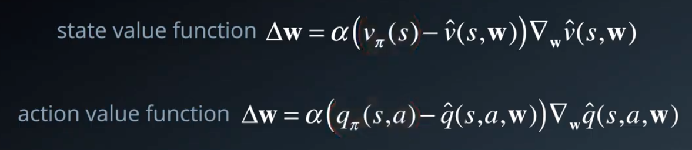

We need to use a more realistic target that is based on our interactions with the environment this is where R.L. fundamentally differs from supervised learning. 

>  **Next we'll look at some strategies we can apply to find suitable targets to use in place of the true value functions in these equations**

## 2. First strategy: Monte Carlo Learning

Our first strategy is to use Monte Carlo Learning. Recall the incremental step that is used in classical Monte Carlo Learning to update value functions. Here $G_t$ is the return that is the cumulative discounted reward received following time $T$. That's a suitable target to attain —> So let's take our neural network update rule and simply substitute the unknown true value function with this return this gives us a concrete update rule for state value functions represented by neural nets or other function approximaters.

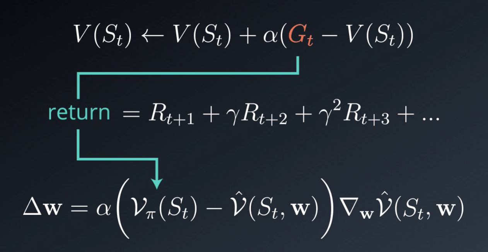

We can do the same for action function as well now that we have the main building block the update rule. 

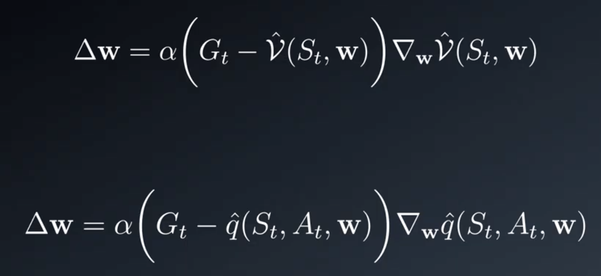

Let's build a complete Monte Carlo Algorithm around that. Let's focus on the control problem and adapt our classic MC algorithm to work with a function approximater. It generally includes an evaluation step where we try to estimate the value of each state action pair under the current policy. We do this by interacting with the environment to generate an episode using the policy $\pi$ and then for each time step $t$ in the episode we update the parameter vector $\mathbf{w}$ using the state action pair

This is followed by an improvement step where we extract an epsilon-greedy policy based on these $q$ values. At the begining we need to initialise our parameters $w$, let's say we do that randomly and start with a policy $\pi$ defined in the same epsilon-greedy manner

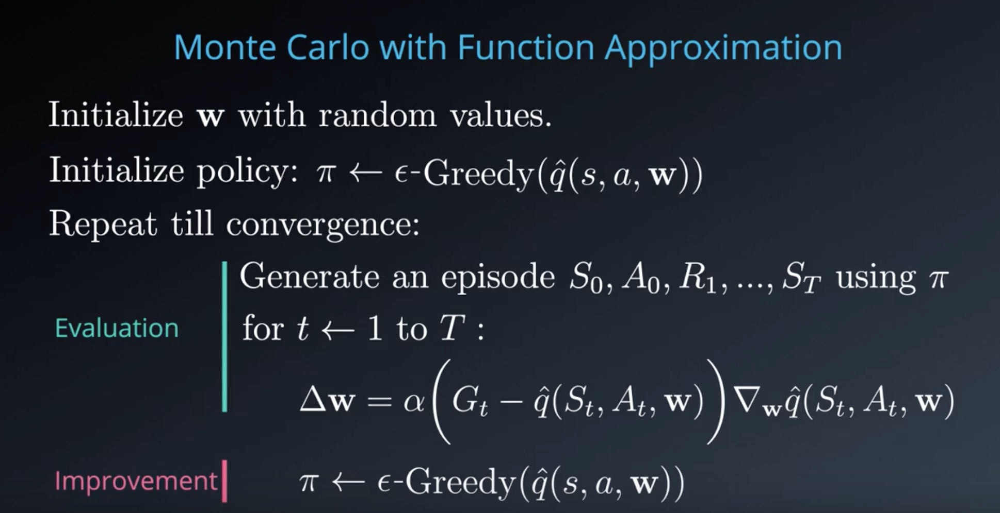

Note that this is the **every visit function**. For the first-visit version you only perform the weight update when you see the state action pair for the first time in an episode.

## 3. Second strategy: Temporal Difference Learning

Our second strategy will be to develop a **Temporal Difference Learning** with function approximation.

Compare the incremental update step between MC learning where we use the actual return obtained through the episode with the temporal difference case where we use an estimated return, this is called the TD target and in the simplest case TD(0) we use the next reward plus the discounted value of the next state. 

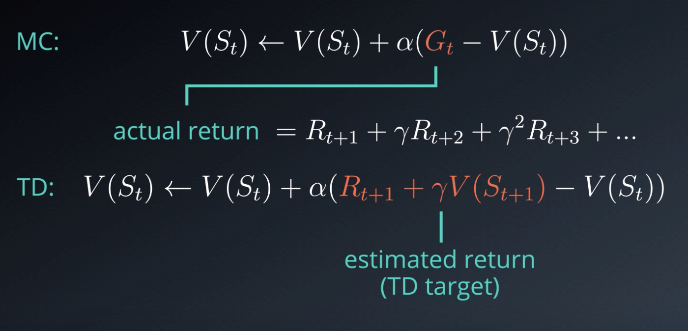

In a similar manner as before we can use this TD target in place of our unknown true value function this gives us something concrete to work with, no more Oracle's. Note that had to adapt the value function to use our function approximater $\hat{V}$ 

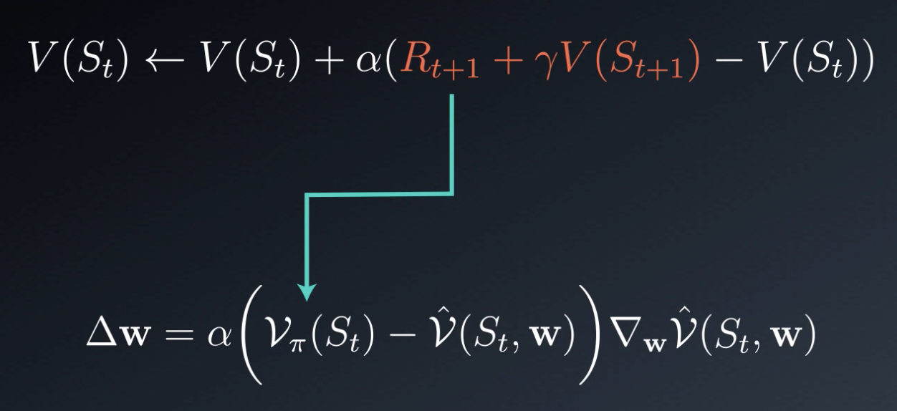

This entire difference is called the TD error and denoted by  $\delta_t$

We can write the update rule and define the TD error

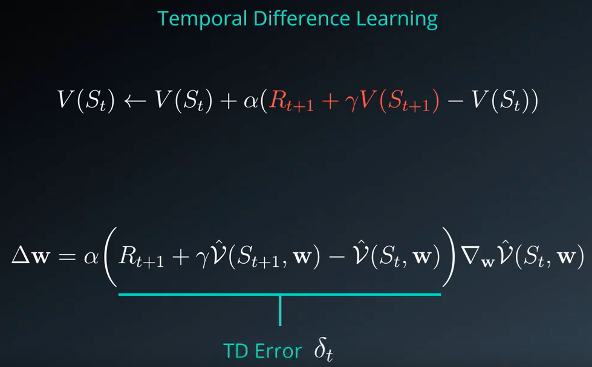

We can extend the same idea to action value function as well. 

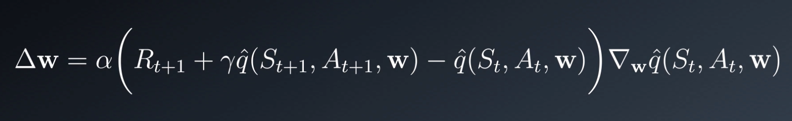

Now we are ready to build an algorithm around this update rule, we will use a TD(0) target and focus on the control problem, again, as you may recall this is essentially the Sarsa algorithm. We have everything we need for the Sarsa update (S; A; R, S'; A'), **this formulation is efficient for episodic tasks** where each episod is guaranted to terminate

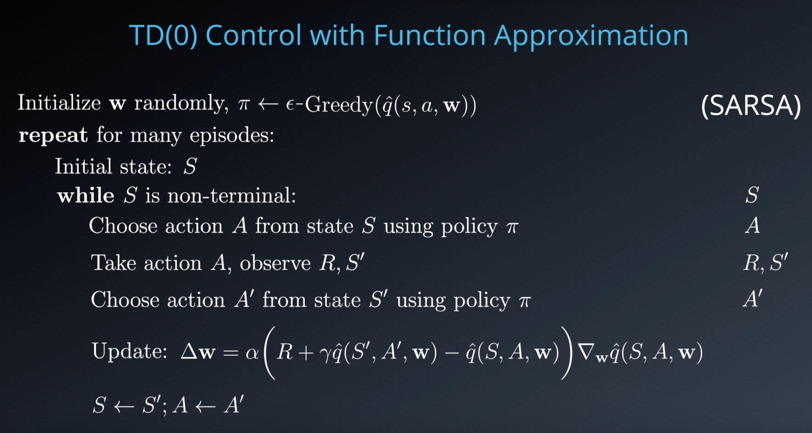

It can be adapted to continuing tasks by eliminating the distinct boundary between episodes. Sarsa is an On-policy algorithm which means that we are updating the same policy that we are following to carry out action this usually works very well and converges pretty quickly because we are using the most updated policy to take each decision but this also has some drawbacks mainly that the policy being learned and the one being followed are intimately tied to each other. What is we wanted to follow one policy say one that is more explanatory while learning the more optimal policy that's where we need off policy algorithms.

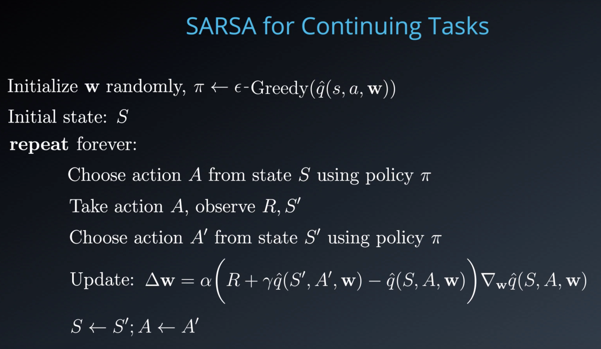

## 4. Q-Learning

Q-learning is an off policy variant of TD learning, let's see how we can adapt it to work with function approximation. Just like Sarsa, we will use basically the same techniques with a difference in the update step instead of picking the next action from the same epsilon greedy policy we choose an action greedily which would maximise the expected value going forward. 

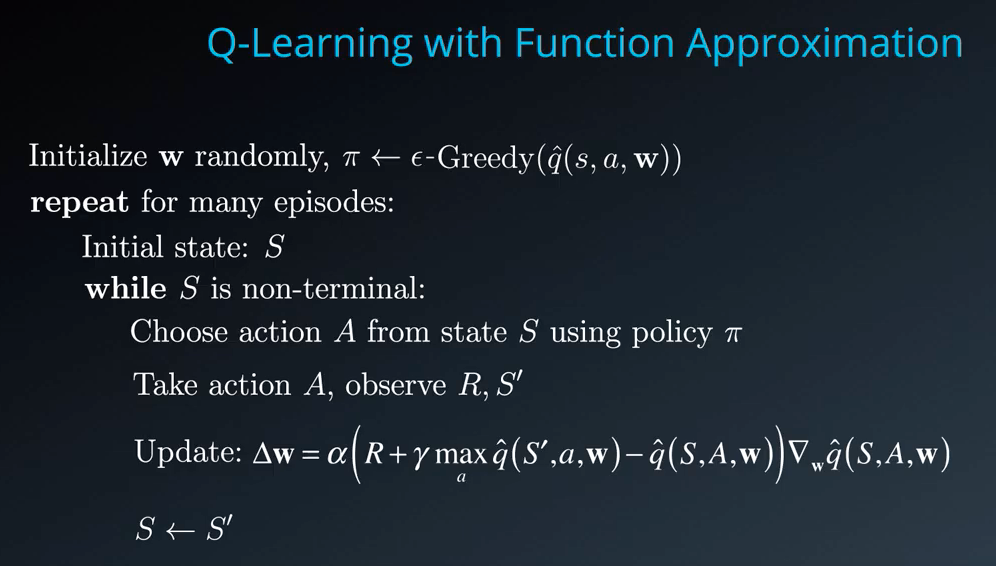

It is considered as an off policy method we use one policy to take actions, the epsilon-greedy policy and yet another policy to perform value updates, a greedy policy. Althought both of them are defined on the same underlying Q values these two are indeed different policies.

Alright this is what the Q learning algorithm looks like for episodic tasks, we can use the same algorithm for continuing tasks by treating the whole unending sequence as one long episode or modify it slightly to remove the concept of episodes. Both froms are equivalent in either case we may need some additional criteria to figure out when we have fully learned the tasks or to detect if we are failing miserably

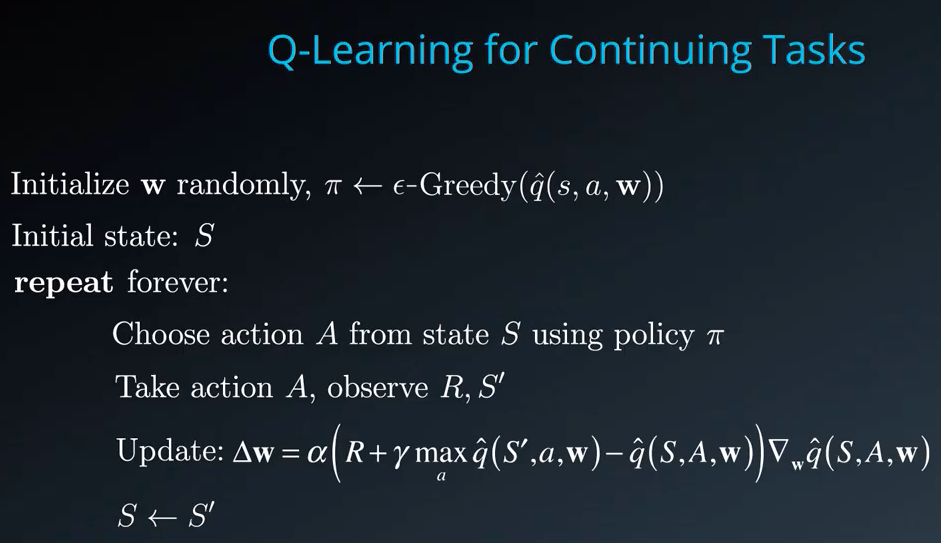

Let's take a moment to compare Sarsa and Q-Learning:

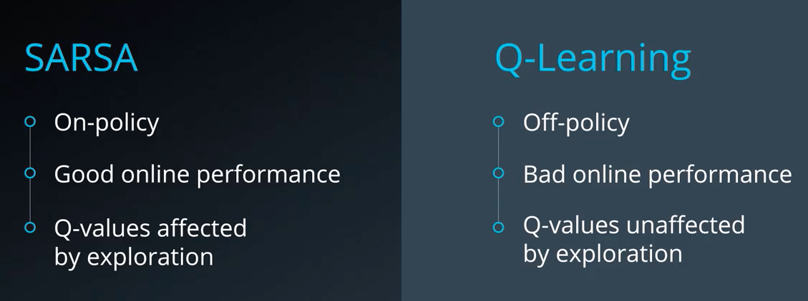

The real reason why method like Q-learning have got so much attention is that they decouple the actions an agent takes in the environment from its learning process. That gives us the opportunity to build different variations of our learning algorithm. For instance, you can use a more explonatory policy while acting and yet learn the optimal value function.

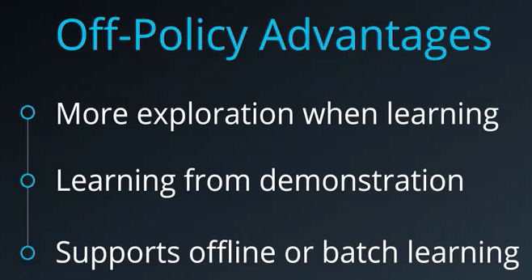

Yes, the online performance will be bad but at some point we can stop exploring and follow the optimal policy for better results. In fact, the policy used to take actions need not be the agent own, a human can demonstrates what actions to take and the agent can learn from observing the effects of those actions it also makes it easier to learn offline or in batches since an update to the policy need not to be performed at every step this as we will see is critical for reliably training neural nets for R.L.

## 5. Deep Q Network

In 2015 deepmind made a breakthrough by designing an agent that learned to play video games better than humans. Yes, it's probably easy to write program that plays pong perfectly if you have access to the underlying game state position of the ball, paddles etc. But this agent was only given raw pixel data. And it learnt to play a bunch of different Atari games all from scratch, they called this agent deep Q-network.

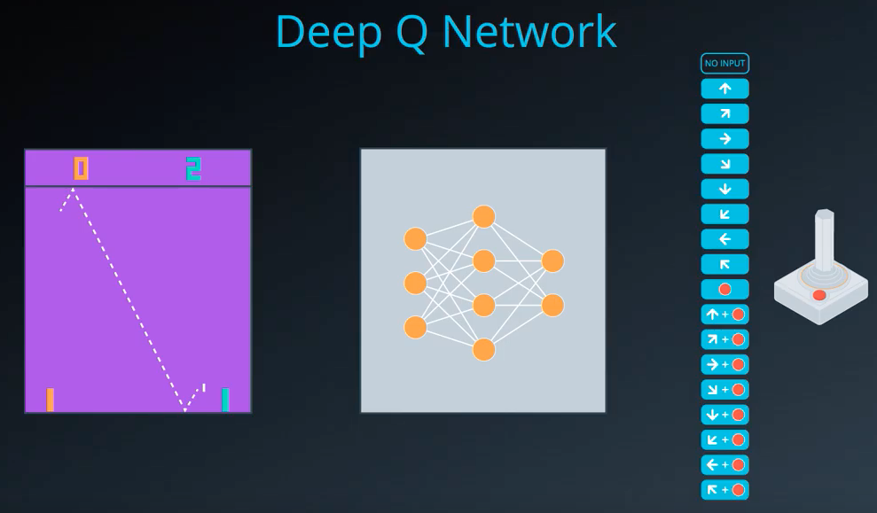

You pass an image from your favorite video game, on screen. It produces a vector of action values with the max value indicating the action to take as a reinforcement signal it is fed back the change in game score at each time step. At the beginning when the neural nets is initialised with random values the actions taken are all over the place it's really bad as you would expect but over time it begins to associate situations and sequences in the game with appropriate actions and learns to actually play the game well.

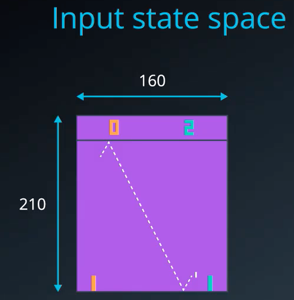

Consider how complex the input space is Atari games are displayed at a resolution of $210 \times 160$ pixels and $128$ possible colors for each pixel. This is technically a discrete state space but very large to process as is. To reduce this complexity the deep mind team decided to perform some minimal pre processing like to convert the images to grayscale and scale them down to a square $84 \times 84$ pixel block square images allowed them to use more optimized neural nets operations on GPUs in order to give the agent access to a sequence of frames they stacked four such frames together resulting in a final state space size of $84 \times 84 \times 4$  there might be other approaches to dealing with sequential data but this was a simple approach that seemed to work pretty well.

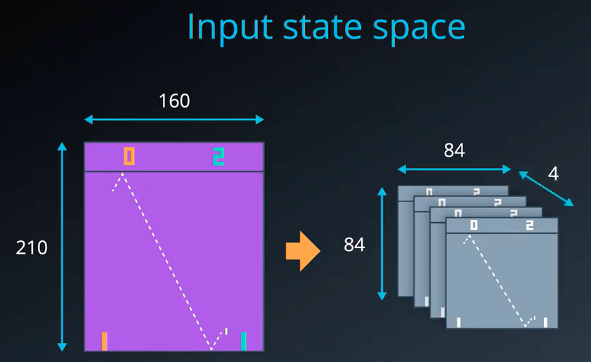

 On the output side unlike a traditional R.L. setup where only one Q value is produced at a time the deep Q-network is designed to produce a Q-value for every possible action in a single forward pass without this you would have to run the network individually for every action instead you can now simply use this vector to take an action either stochastically or by choosing the one with the maximum value.

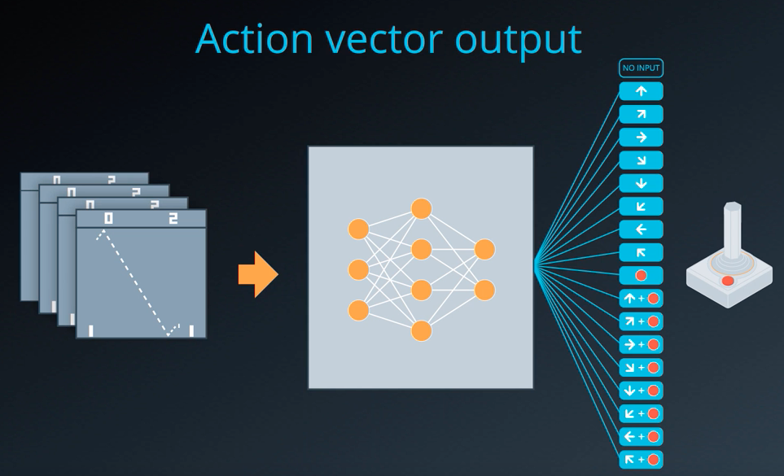

These innovative input and output transformations support a powerful yet simple neural network architecture. Under the hood the screen images are first processed by convolutional layers this allows the system to exploit spatial relationship and exploit spatial rules based also since four frames are stacked and provided as input these convolutional layers also extract some temporal properties across those frames. The original deep Q network agent used three such conv layers with ReLU activation

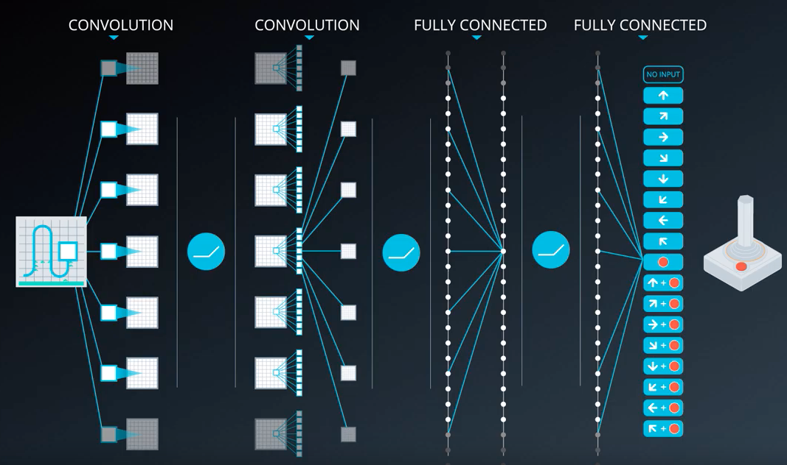

Training such a network requires a lot of data but even then it is not guaranteed to converge on the optimal value function in fact there are situations where the network weights can oscillate or diverge due to the high correlation between actions and states. In order to overcomes those challenges the researchers came up with several techniques that slightly modify the base Q-learning algorithm.

## 6. Experience Replay

The idea of *Experience Replay* and its application to training neural nets for R.L. isn't new, it was originally proposed to make more efficient use of observed experiences.

Consider the basic online Q-learning algorithm where we interact with the environment and at each time step we obtain a state action reward next state tuple learn from it and then discard it moving on to the next tuple. This seems a little wasteful, we could possibly learn more from these experience tuple if we stored them somewhere moreover some state are pretty rare to come by and some actions can be pretty costly so it would be nice to recall such experiences, **that is exactly what a replay buffer is**.

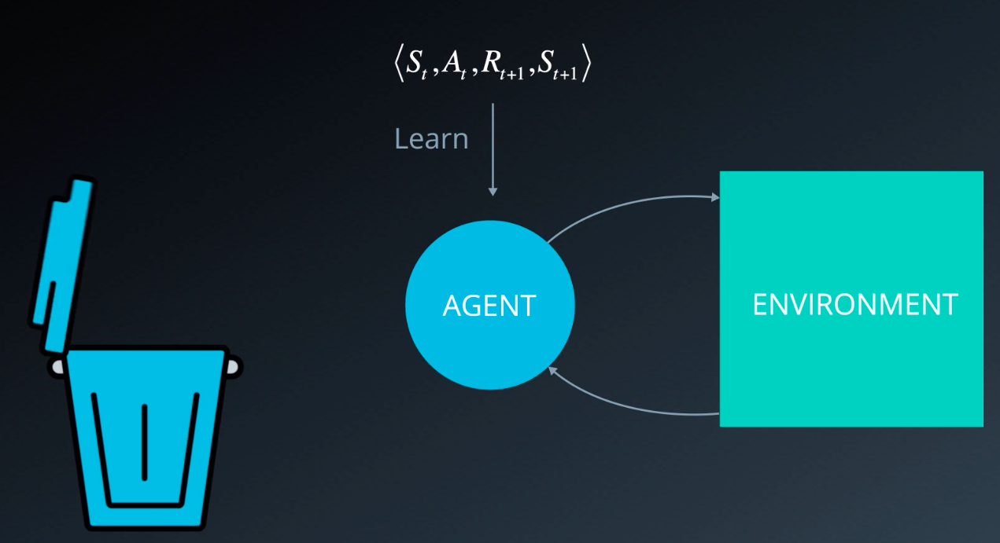

It stores each experience tuple in this buffer as we are interacting with the environment and then sample a small batch of tuples from it in order to learn as a result we are able to learn from individual tuples multiple time. Recall rare occurences and in general make better use of our experience but there is another critical problem that experience replay can help with and this is what DQn takes advantage of if you think about the experiences being obtained you'll realize that every action $A_t$ affects the next state $S_t$ in some way which means that *a sequence of tuples can be highly correlated*. With experience replay we can sample from this buffer at random it doesn't have to be in the same sequence this helps break the correlation and ultimately prevents action values from oscillating or diverging.

**<u>Let's look at an example where we learn tennis</u>:**

(backhand and forehead = revers et coup droit)

I like to practice rallying against the wall I'm more confident with my forehand shot than my backhand and I can hit the ball fairly straight so the ball keeps coming back around the same area on my right

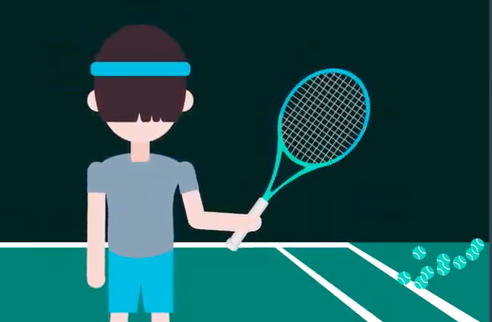

If I was an online Q-learning agent learning as I play this is what I should hit with my forehand less certainly at first but with increasing confidence as I repeatedly hit the ball. I am learning to play forehand pretty well but I'm not exploring the rest of the state space this could be addressed by using an epsilon greedy policy, we learn the optimal policy, and end up by playing a backhand and forehead appropriately.

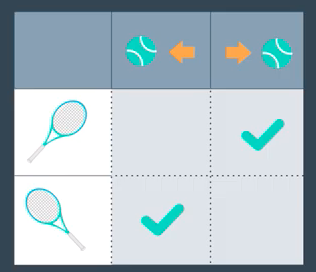

We consider now a continuous state space things fall appart, the ball can actually come anywhere between the extreme left and extreme right. If we try to discrete this range into small buckets we would have too many possibilities, it could also be possible to have states we have never visited. Instead it makes more sense to use a function approximation like a linear combination of RBF kernels or a Q-nets that can generalize the learning accross the space. 

* Now every time the ball comes to my right hand I successfully hit a forehand shot my value function changes slightly it becomes more positive around the exact region and it raises the value for the forehand

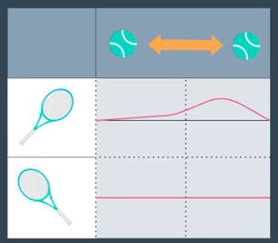

* Unfortunately if we need some backhand we might miss all the time —> What we should do is to stop learning while practicing. This time is best spent in trying out different shots playing a little randomly and thus exploring the state space it then, remember all the interactions

If you think about it this approach is basically building a database of samples and then learning a mapping from them in that sense experience replay helps us reduce the reinforcement learning problem or at least the value learning portion to a supervised learning scenario. We can then apply other model developped in the supervised framework.

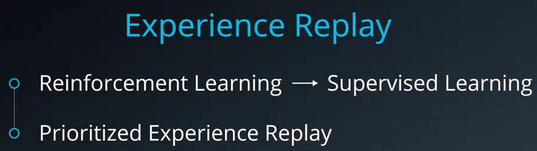

## 7. Fixed Q Targets

Experience replay helps us address one type of correlation that is between consecutive experience tuples. There is another kind of correlation that Q-learning is susceptible to.
Q-learning is a form of Temporal difference or TD-learning, the TD target is supposed to be a replacement for the true value function which is unknown to us.

$q_ \pi$ is not dependent on our function approximation or its parameters thus resulting in a simple derivative and update rule but our TD target is dependent on these parameters which means simply replacing the true value function $q_ \pi$ with a target like this is mathematically incorrect.

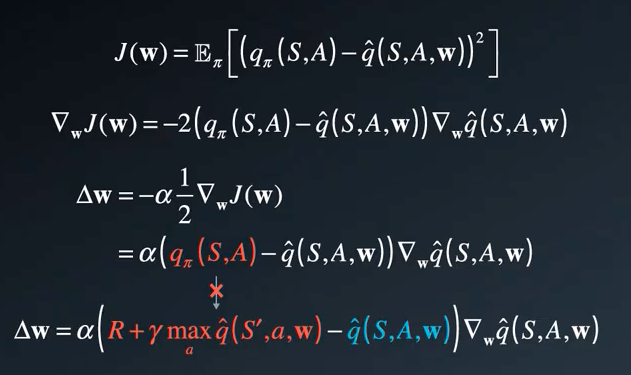

We can get away with it in practice because every update results in a small change to the parameters which is generally in the right direction if we set alpha equals to 1 and leap towards the target then we'd likely overshoot and land in the wrong place also this is less of a concern when we use a lookup table or dictionary since Q values are stored separately for each state action pair but it can affect learning significantly when we use function approximation where all the Q values are tied together through the function parameters.

Experience replay addresses a similar but slightly different issue there we broke the correlation effects between consecutive experience tuples by sampling them randomly out of order. Here the correlation is between the target and the parameters we are changing this like chasing a moving target literally. 

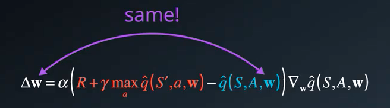

Analogy du donkey on doit decouple the targets position from the donkey's actions giving it a more stable learning environment. (on ne s'assoit pas sur l'ane avec la carotte, mais on est à côté et on l'amène ou on veut, car quand on est dessus le baton bouge de façon aléatoire)

We can do the same on the equation:

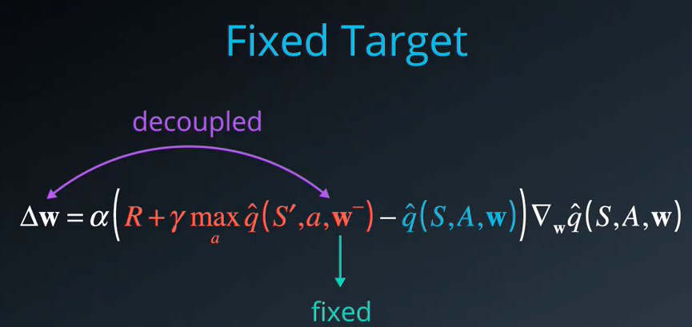

## 8. Deep Q-Learning Algorithm

We're now ready to take a look at the deep Q-learning algorithm and implement it on our own there are two main processes that are interleaved in this algorithm:

* one if where we sample the environment by performing actions and store away the observed experience tuples in a replay memory
* the other is where we select a small batch of tuples from this memory randomly and learn from that batch using a gradient descent update step

These two processes are not directly dependent on each other so we could perform multiple sampling steps than one learning step or even multiple learning steps with different random batches. The rest of the algorithm is designed to support these steps

*  in the beginning you need to initialise an empty replay memory $D$ , note that the memory is finite so we may want to use something like a circular $Q$ that retains the $N$ most recent experience tuples then 
* we also need to initialise the parameters or weights of the neural nets
* To use the fixed queue targets technique we need a second set of parameter $w^{-}$ which we can initialise to $w$. 
* Then recall that the algorithm was designed to play videogames so for each episode and each time step $t$ within that episode we observe a raw screen image which we need to preprocess. We will denote with the function $\phi$ the pre-processing and stacking operation.

There are also a lot of other techniques in the paper like error clipping ...

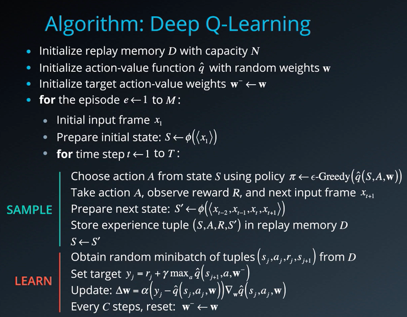

## 9. Deep Q-Learning Improvements

We will look at three improvements to the algorithm:

1. Double DQNs
2. Prioritized Replay
3. Dueling Networks

<u>First problem</u> is the overstimation of Q-values, let's focus on the TD target, here the max operation is necessary to find the best possible value we could get from the next state to understand this better let's rewrite the target and expand the max operation

