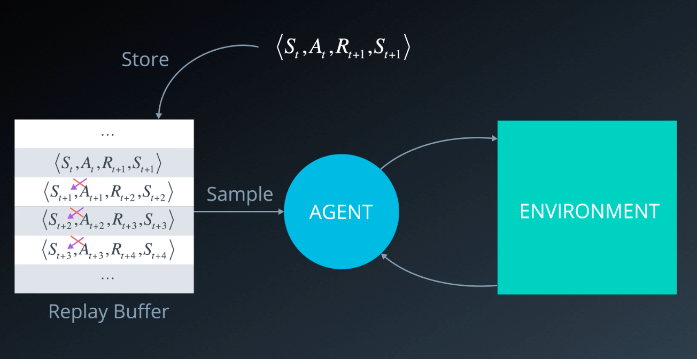

# Lesson 9: Deep Q-Learning

## 1. Introduction

Deep Q-Learning is an elegant algorithm that demonstrates how we can use neural networks to solve reinforcement learning problems. It has expanded the range of domains we can tackle especially those with large and continuous state spaces. 

We will first take a look at how Neural Networks can be used to represent value functions

Next we'll adapt the two main classes of model: Monte Carlo and Temporal difference learning to work with this new representation. You'll learn to harness the power of deep learning including convolutional and reccurent neural nets to teach computers tasks that seem almost impossible to learn from scratch like playing video games.

## 1. Neurals Nets as Value Functions

How do neural nets fits into Reinforcement Learning ? Remember how neural nets are touted as universal function approximaters. What if we use neural nets to represent our value function

The question is how do we learn these parameters if we have a reference or target we're trying to reach for example $v_{\pi}$ provided by some oracle we can use the square difference as our error or loss. Then we can backpropagate to adjust the weight. One of the popular method is gradient descent where we update weights a small step away from the direction of error.

To train neural nets we need a way to figure out the loss and that's where our knowledge of reinforcement learning comes in. At this point, let's also consider the action value function $Q$, the update rule looks very similar to what we had for the state value function $v$ but we have the same problem here for most practical problems there is no Oracle to tell us what the correct value $v_{\pi}$ or $q_{\pi}$ should be. 

We need to use a more realistic target that is based on our interactions with the environment this is where R.L. fundamentally differs from supervised learning. 

>  **Next we'll look at some strategies we can apply to find suitable targets to use in place of the true value functions in these equations**

## 2. First strategy: Monte Carlo Learning

Our first strategy is to use Monte Carlo Learning. Recall the incremental step that is used in classical Monte Carlo Learning to update value functions. Here $G_t$ is the return that is the cumulative discounted reward received following time $T$. That's a suitable target to attain —> So let's take our neural network update rule and simply substitute the unknown true value function with this return this gives us a concrete update rule for state value functions represented by neural nets or other function approximaters.

We can do the same for action function as well now that we have the main building block the update rule. 

Let's build a complete Monte Carlo Algorithm around that. Let's focus on the control problem and adapt our classic MC algorithm to work with a function approximater. It generally includes an evaluation step where we try to estimate the value of each state action pair under the current policy. We do this by interacting with the environment to generate an episode using the policy $\pi$ and then for each time step $t$ in the episode we update the parameter vector $w$ using the state action pair

This is followed by an improvement step where we extract an epsilon-greedy policy based on these $q$ values. At the begining we need to initialise our parameters $w$, let's say we do that randomly and start with a policy $\pi$ defined in the same epsilon-greedy manner

Note that this is the **every visit function**. For the first-visit version you only perform the weight update when you see the state action pair for the first time in an episode.

## 3. Second strategy: Temporal Difference Learning

Our second strategy will be to develop a **Temporal Difference Learning** with function approximation.

Compare the incremental update step between MC learning where we use the actual return obtained through the episode with the temporal difference case where we use an estimated return, this is called the TD target and in the simplest case TD(0) we use the next reward plus the discounted value of the next state. 

In a similar manner as before we can use this TD target in place of our unknown true value function this gives us something concrete to work with, no more Oracle's. Note that had to adapt the value function to use our function approximater $\hat{V}$ 

This entire difference is called the TD error and denoted by  $\delta_t$

We can write the update rule and define the TD error

We can extend the same idea to action value function as well. 

Now we are ready to build an algorithm around this update rule, we will use a TD(0) target and focus on the control problem, again, as you may recall this is essentially the Sarsa algorithm. We have everything we need for the Sarsa update (S; A; R, S'; A'), **this formulation is efficient for episodic tasks** where each episod is guaranted to terminate

It can be adapted to continuing tasks by eliminating the distinct boundary between episodes. Sarsa is an On-policy algorithm which means that we are updating the same policy that we are following to carry out action this usually works very well and converges pretty quickly because we are using the most updated policy to take each decision but this also has some drawbacks mainly that the policy being learned and the one being followed are intimately tied to each other. What is we wanted to follow one policy say one that is more explanatory while learning the more optimal policy that's where we need off policy algorithms.

## 4. Q-Learning

Q-learning is an off policy variant of TD learning, let's see how we can adapt it to work with function approximation. Just like Sarsa, we will use basically the same techniques with a difference in the update step instead of picking the next action from the same epsilon greedy policy we choose an action greedily which would maximise the expected value going forward. 

It is considered as an off policy method we use one policy to take actions, the epsilon-greedy policy and yet another policy to perform value updates, a greedy policy. Althought both of them are defined on the same underlying Q values these two are indeed different policies.

Alright this is what the Q learning algorithm looks like for episodic tasks, we can use the same algorithm for continuing tasks by treating the whole unending sequence as one long episode or modify it slightly to remove the concept of episodes. Both froms are equivalent in either case we may need some additional criteria to figure out when we have fully learned the tasks or to detect if we are failing miserably

Let's take a moment to compare Sarsa and Q-Learning:

The real reason why method like Q-learning have got so much attention is that they decouple the actions an agent takes in the environment from its learning process. That gives us the opportunity to build different variations of our learning algorithm. For instance, you can use a more explonatory policy while acting and yet learn the optimal value function.

Yes, the online performance will be bad but at some point we can stop exploring and follow the optimal policy for better results. In fact, the policy used to take actions need not be the agent own, a human can demonstrates what actions to take and the agent can learn from observing the effects of those actions it also makes it easier to learn offline or in batches since an update to the policy need not to be performed at every step this as we will see is critical for reliably training neural nets for R.L.

## 5. Deep Q Network

In 2015 deepmind made a breakthrough by designing an agent that learned to play video games better than humans. Yes, it's probably easy to write program that plays pong perfectly if you have access to the underlying game state position of the ball, paddles etc. But this agent was only given raw pixel data. And it learnt to play a bunch of different Atari games all from scratch, they called this agent deep Q-network.

You pass an image from your favorite video game, on screen. It produces a vector of action values with the max value indicating the action to take as a reinforcement signal it is fed back the change in game score at each time step. At the beginning when the neural nets is initialised with random values the actions taken are all over the place it's really bad as you would expect but over time it begins to associate situations and sequences in the game with appropriate actions and learns to actually play the game well.

Consider how complex the input space is Atari games are displayed at a resolution of $210 \times 160$ pixels and $128$ possible colors for each pixel. This is technically a discrete state space but very large to process as is. To reduce this complexity the deep mind team decided to perform some minimal pre processing like to convert the images to grayscale and scale them down to a square $84 \times 84$ pixel block square images allowed them to use more optimized neural nets operations on GPUs in order to give the agent access to a sequence of frames they stacked four such frames together resulting in a final state space size of $84 \times 84 \times 4$  there might be other approaches to dealing with sequential data but this was a simple approach that seemed to work pretty well.

 On the output side unlike a traditional R.L. setup where only one Q value is produced at a time the deep Q-network is designed to produce a Q-value for every possible action in a single forward pass without this you would have to run the network individually for every action instead you can now simply use this vector to take an action either stochastically or by choosing the one with the maximum value.

These innovative input and output transformations support a powerful yet simple neural network architecture. Under the hood the screen images are first processed by convolutional layers this allows the system to exploit spatial relationship and exploit spatial rules based also since four frames are stacked and provided as input these convolutional layers also extract some temporal properties across those frames. The original deep Q network agent used three such conv layers with ReLU activation

Training such a network requires a lot of data but even then it is not guaranteed to converge on the optimal value function in fact there are situations where the network weights can oscillate or diverge due to the high correlation between actions and states. In order to overcomes those challenges the researchers came up with several techniques that slightly modify the base Q-learning algorithm.

## 6. Experience Replay

